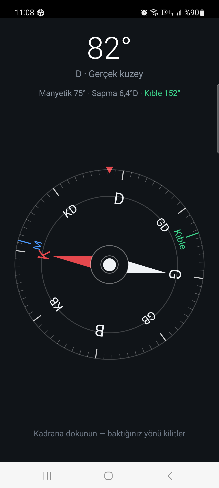
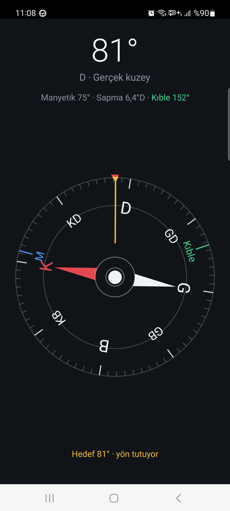
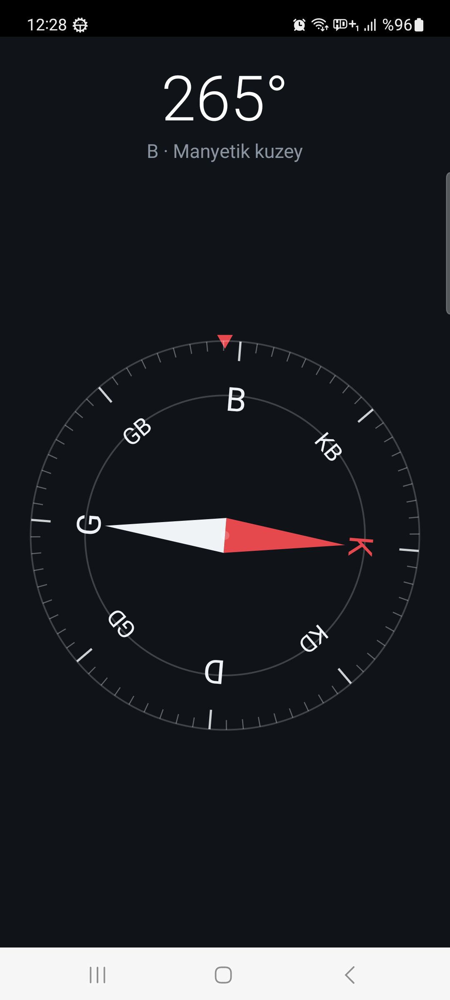

# Pusula

Android için sade bir pusula uygulaması. Dış bağımlılığı yok — sadece Android SDK
ve Kotlin standart kütüphanesi kullanılıyor, kadran `Canvas` ile elle çiziliyor.

Gerçek kuzey, kıble yönü, dokununca yön kilitleyen hedef göstergesi ve kadranın
göbeğinde su terazisi.

- `minSdk 24` (Android 7.0) — **Android 13 dahil** tüm sürümlerde çalışır
- `targetSdk 34`
- Paket adı: `com.cem.pusula`
- İzinler: `ACCESS_COARSE_LOCATION` ve `ACCESS_FINE_LOCATION` (gerçek kuzey, kıble
  ve koordinat paneli için; reddedilirse uygulama manyetik kuzeyle çalışmaya devam
  eder, "yaklaşık" seçilirse koordinatlar o etiketle gösterilir).

## 0. Klasör düzeni

```
pusula/
├── app/          uygulama kaynağı
├── dist/         üretilen APK'lar          (gitignore'da)
├── docs/         ekran görüntüleri, ikon
├── keys/         imzalama anahtarı         (gitignore'da)
└── keystore.properties                     (gitignore'da)
```

| Ekran | | |
|---|---|---|
|  |  |  |
| Konum izni verilince: gerçek kuzey, manyetik yön, sapma ve kıble; kadranda mavi **M** ile yeşil **Kıble** işaretleri | Kadrana dokununca yön kilitlenir: sarı hat ve "kaç derece sağa/sola" satırı | İzin yokken: manyetik kuzeyle çalışmaya devam eder |

## 1. Hazır APK'yı telefona kurmak

Derlenmiş APK: `app/build/outputs/apk/debug/app-debug.apk` (~800 KB)

### Yöntem A — Kabloyla, adb ile (en hızlı)

Telefonda önce **geliştirici seçenekleri**ni açın:

1. `Ayarlar → Telefon hakkında → Yapı numarası` üstüne 7 kez dokunun.
2. `Ayarlar → Sistem → Geliştirici seçenekleri → USB hata ayıklama` (USB debugging) → açın.
3. Telefonu USB ile bilgisayara bağlayın, ekranda çıkan **"Bu bilgisayara izin ver"**
   uyarısını onaylayın.

Sonra:

```bash
export ANDROID_HOME=$HOME/Android/Sdk
$ANDROID_HOME/platform-tools/adb devices        # telefon "device" olarak görünmeli
$ANDROID_HOME/platform-tools/adb install -r app/build/outputs/apk/debug/app-debug.apk
```

Doğrudan derleyip kurmak için tek komut da yeterli:

```bash
./gradlew installDebug
```

### Yöntem B — Kablosuz adb (Android 11+, kablo gerekmez)

`Geliştirici seçenekleri → Kablosuz hata ayıklama` → **Cihazı eşleştirme kodu ile eşleştir**:

```bash
adb pair <telefon-ip>:<eşleştirme-portu>     # ekrandaki 6 haneli kodu girin
adb connect <telefon-ip>:<bağlantı-portu>    # kablosuz hata ayıklama ekranındaki port
adb install -r app/build/outputs/apk/debug/app-debug.apk
```

### Yöntem C — Dosyayı telefona kopyalayıp elle kurmak (bilgisayarda adb gerekmez)

APK'yı telefona aktarın (e-posta, Drive, USB bellek, `scp`, ne kolaysa), telefonda
dosya yöneticisinden dosyaya dokunun. Android 13 size **"Bu kaynaktan uygulama
yüklemeye izin ver"** diye soracaktır:

`Ayarlar → Uygulamalar → Özel uygulama erişimi → Bilinmeyen uygulamaları yükle →
(dosya yöneticisi / tarayıcı) → Bu kaynağa izin ver`

İzni verdikten sonra kurulum ekranı açılır. Play Protect "bilinmeyen geliştirici"
uyarısı verirse **Yine de yükle** deyin — kendi imzaladığınız APK olduğu için normaldir.

> Android 13'te, APK'yı bir dosya yöneticisi üzerinden kurduğunuzda uygulama
> "kısıtlı ayarlar" kapsamına girebilir. Erişilebilirlik/bildirim gibi hassas
> ayarlara ihtiyacı olmadığı için bu uygulamada sorun çıkarmaz.

## 2. Kaynaktan derlemek

Gerekli olanlar: JDK 17+ ve Android SDK (platform 34 + build-tools 34.0.0).

```bash
export ANDROID_HOME=$HOME/Android/Sdk
echo "sdk.dir=$ANDROID_HOME" > local.properties   # yoksa oluşturun
./gradlew assembleDebug        # -> app/build/outputs/apk/debug/app-debug.apk
```

Android Studio kullanacaksanız: `File → Open` ile bu klasörü açın, telefonu bağlayın,
yeşil **Run** düğmesine basın — derleme ve kurulum tek adımda yapılır.

### Android SDK'yı komut satırından kurmak (Android Studio olmadan)

```bash
mkdir -p ~/Android/Sdk/cmdline-tools && cd ~/Android/Sdk/cmdline-tools
curl -O https://dl.google.com/android/repository/commandlinetools-linux-16111833_latest.zip
unzip commandlinetools-linux-16111833_latest.zip && mv cmdline-tools latest
export ANDROID_HOME=$HOME/Android/Sdk
yes | $ANDROID_HOME/cmdline-tools/latest/bin/sdkmanager --licenses
$ANDROID_HOME/cmdline-tools/latest/bin/sdkmanager "platform-tools" "platforms;android-34" "build-tools;34.0.0"
```

## 3. Kalıcı kurulum için release APK (önerilir)

Debug APK'ları ortak bir debug anahtarıyla imzalanır. Uygulamayı uzun süre kendi
telefonunuzda tutup güncelleyecekseniz, kendi anahtarınızla imzalanmış bir release
APK üretin — böylece sürüm yükseltmelerinde "imza uyuşmuyor" hatası almazsınız.

```bash
mkdir -p keys
keytool -genkeypair -v -keystore keys/pusula-release.jks -alias pusula \
    -keyalg RSA -keysize 2048 -validity 10000

cat > keystore.properties <<EOF
storeFile=keys/pusula-release.jks
storePassword=...
keyAlias=pusula
keyPassword=...
EOF

./gradlew assembleRelease   # -> app/build/outputs/apk/release/app-release.apk
```

`storeFile` yolu proje köküne göre çözülür, bu yüzden proje klasörünü taşımak
ayarı bozmaz.

`keys/`, `dist/` ve `keystore.properties` `.gitignore`'da — commit etmeyin,
**ve `.jks` dosyasını kaybetmeyin**: uygulamayı güncelleyebilmenin tek yolu odur.
`keystore.properties` yoksa build dosyası bu bloğu sessizce atlar, `assembleDebug`
her koşulda çalışır.

## 4. Gerçek kuzey ve manyetik kuzey

Uygulama ikisini birden gösterir:

- **Büyük rakam** gerçek (coğrafi) kuzeye göre yöndür — sapma bilinir bilinmez
  buna geçer, bilinmiyorsa manyetik yönü gösterir ve altındaki etiket hangisi
  olduğunu açıkça yazar.
- **Alt satır** manyetik yönü ve o konumdaki sapmayı verir, örn.
  `Manyetik 265° · Sapma 5,8°D`.
- **Kadranda mavi "M" işareti** manyetik kuzeyin nereye düştüğünü gösterir.
  Kadran gerçek kuzeye göre döndüğü için bu işaret K'dan sapma kadar uzakta durur.

Sapma `GeomagneticField(enlem, boylam, rakım, zaman).declination` ile hesaplanır;
doğuya doğru pozitiftir ve `gerçek = manyetik + sapma` formülüyle uygulanır.
Türkiye'de yaklaşık +5° ile +7° arasındadır.

Bunun için yaklaşık konum yeter, o yüzden yalnızca `ACCESS_COARSE_LOCATION`
isteniyor. Konum `LocationManager`'ın en son bilinen konumundan alınır (Google
Play Hizmetleri gerekmez); bulunan sapma `SharedPreferences`'a yazıldığı için
sonraki açılışlarda gerçek kuzey anında gösterilir. İzin verilmezse alt satır
"Gerçek kuzey için konum izni gerekli" yazar ve dokununca izni yeniden ister;
kalıcı reddedilmişse uygulama ayarlarını açar. İzin olmadan da uygulama
manyetik kuzeyle sorunsuz çalışır.

**Manyetik bozulma uyarısı.** Sapma doğru hesaplansa bile, telefonun yakınındaki
bir mıknatıs ya da mıknatıslanmış metal pusulayı sessizce yanıltır: açı yanlıştır
ama ekranda hiçbir şey belli olmaz. Uygulama bunu yakalar — ölçülen toplam alan
şiddetini o konumda beklenenle (`GeomagneticField.getFieldStrength()`) karşılaştırır,
%25'i aşan sapma **kesintisiz 2,5 saniye** sürerse uyarır, %15'in altına inince
uyarıyı hemen kaldırır:

```
Manyetik bozulma: alan 63 µT, beklenen 49 µT — telefonu metal/mıknatıstan uzaklaştırın.
```

Cihazın kendi hassasiyet bayrağı bu durumu genelde fark etmez, çünkü sabit bir
bozulma "kararlı" görünür. Gerçek bir örnek: bilgisayar masasında ölçülen alan
63,3 µT ve manyetik eğim 9,2° idi — İstanbul'un değerleri 48,5 µT ve 58,7°, o eğim
manyetik ekvatora karşılık gelir. Masadan iki metre uzaklaşınca alan 49,5 µT'ye
oturdu ve yön düzeldi. Bu yüzden rotation-vector'e ek olarak ham manyetometre de
dinlenir (`SENSOR_DELAY_UI`): füzyon yönü verir ama alanın büyüklüğünü vermez.

Süre şartının sebebi: telefonu elde çevirirken kalibrasyon geçici olarak %20'ye
varan sapma üretebiliyor. Süre şartı olmadan eşiği düşürmek yanlış alarma yol
açardı; süre şartı geldiği için eşik %30'dan %25'e çekilebildi — masadaki gerçek
vaka %31,9 sapma yapıyordu ve %30 eşiği kıl payı geçiyordu, %25 daha emniyetli. Uyarıdaki sayı da her µT oynamasında değil,
2 µT'yi aşan kaymalarda tazeleniyor. Durum satırı yazı gelip gidince ekranın
kaymaması için yerini her zaman ayırır (`minLines="2"`); aksi hâlde uyarı her
çıkışında kadran zıplıyordu.

## 5. Kıble, hedef kilidi, su terazisi ve konum paneli

**Kıble.** Konum bilinince kadranda yeşil **Kıble** işareti ve üst satırda yön
derecesi çıkar. Hesap, bulunduğunuz noktadan Kâbe'ye (21,4225°K / 39,8252°D)
giden büyük daire yayının çıkış açısıdır — kıblenin tanımı budur, düz haritadaki
"sağ alt köşe" yönü değil:

```
θ = atan2( sin Δλ · cos φ₂ ,  cos φ₁ · sin φ₂ − sin φ₁ · cos φ₂ · cos Δλ )
```

Açı gerçek kuzeye göredir, o yüzden kadranla aynı çerçevededir. İstanbul'dan
yaklaşık 152°, Ankara'dan 158° civarı çıkar.

**Hedef kilidi.** Kadrana dokunmak o an baktığınız yönü kilitler: sarı bir hat
kadranda o yönü işaretler, alt satır `Hedef 81° · 12° sağa` diye ne kadar
dönmeniz gerektiğini söyler, ±2° içinde `yön tutuyor` yazar. Tekrar dokunmak
bırakır. Kilit `SharedPreferences`'a yazıldığı için uygulamayı kapatıp açsanız
da durur.

Hedef **manyetik** çerçevede saklanır. Sebebi: konum izni sonradan verilirse
sapma devreye girer ve ekrandaki bütün açılar kayar; hedef manyetik olarak
tutulunca kilitlediğiniz fiziksel yön aynı kalır.

**Su terazisi.** Kadranın göbeğindeki kabarcık telefonun eğimini gösterir.
Gerçek terazideki gibi yukarıda kalan tarafa kaçar, ortalanınca telefon düzdür
ve kabarcık beyaza döner. Eğim, remap edilmiş dönüş matrisinin `[8]` elemanının
ark kosinüsüdür (ekran normalinin düşeyden açısı); 40°'yi geçince "telefonu
yatay tutun" uyarısı çıkar, 30°'nin altına inince kaybolur — sınırda titremesin
diye açma ve kapama eşikleri farklı.

**Konum paneli.** Konum bulununca kadranın altında koordinatlar, rakım ve hata
payı görünür:

```
40,98767° K  29,13664° D · 189 m · ±100 m
```

Satıra **dokunmak** biçimi derece-dakika-saniyeye çevirir
(`40°59'15,6" K  29°08'11,9" D`), tekrar dokunmak ondalığa döndürür. **Uzun
basmak** koordinatları panoya kopyalar; kopyalanan biçim haritalara yapıştırmaya
uygun olsun diye nokta ayraçlı ve işaretlidir (`40.987670, 29.136640`), ekranda
gösterilen biçimden bağımsızdır. Android 13'ten itibaren sistem kendi kopyalama
onayını gösterdiği için uygulama kendi bildirimini o sürümlerde çıkarmaz.

Koordinat paneli anlamlı olsun diye artık hassas konum da isteniyor. Kullanıcı
"yaklaşık"ı seçerse uygulama çalışmaya devam eder ve satırın sonuna *yaklaşık*
yazar — hata payı zaten kilometrelerce olur, bunu gizlemek yanıltıcı olurdu.
Sapma için ağ konumu yeterdi; panel için GPS'in hassasiyeti de gerektiğinden
artık iki sağlayıcı da dinlenir ve gelen fix'lerden en iyisi seçilir (bir
dakikadan yeni olan koşulsuz kazanır, eşit yaştakilerde hata payı küçük olan).

## 6. Kodun yapısı

Uygulama hem dikey hem yatay çalışır. `remapCoordinateSystem` zaten sensör
eksenlerini ekran yönüne göre eşlediği için okuma her iki yönde de **ekranın üst
kenarının** baktığı yönü verir; telefonu yan çevirince açı 90° kayar, çünkü artık
farklı bir kenar öne bakmaktadır. Yatay yerleşim ayrı bir dosyada (`layout-land/`),
kimlikler aynı olduğu için kod değişmez.

| Dosya | İş |
|---|---|
| `app/src/main/java/com/cem/pusula/MainActivity.kt` | Sensör okuma, açı hesabı, yumuşatma, konum/sapma/kıble, hedef kilidi |
| `app/src/main/java/com/cem/pusula/CompassView.kt` | Kadranın `Canvas` ile çizimi: ibre, işaretler, su terazisi |
| `app/src/main/res/layout/activity_main.xml` | Dikey yerleşim: yazılar üstte, kadran altta |
| `app/src/main/res/layout-land/activity_main.xml` | Yatay yerleşim: yazılar solda, kadran sağda |

Nasıl çalışıyor:

- Öncelik `TYPE_ROTATION_VECTOR` sensöründe; cihazda yoksa ivmeölçer + manyetometre
  ikilisine düşülür (`getRotationMatrix`).
- `remapCoordinateSystem` ile sensör eksenleri ekran yönüne göre eşlenir.
- Açı doğrudan değil, `sin`/`cos` bileşenleri üzerinden yumuşatılır — aksi hâlde
  359° → 0° geçişinde ibre bir tam tur atardı. Yumuşatma katsayısı `alpha = 0.12f`;
  daha çevik istiyorsanız büyütün, daha sakin istiyorsanız küçültün.
- Aynı `getOrientation` çağrısının `[1]` ve `[2]` değerleri (pitch/roll) su
  terazisini besler; onlar da aynı katsayıyla yumuşatılır.
- Sensör hassasiyeti düştüğünde ekranda kalibrasyon uyarısı çıkar (telefonu havada
  8 çizer gibi hareket ettirmek düzeltir). Kalibrasyon uyarısı, eğim uyarısından
  önceliklidir.
- Durum satırında öncelik sırası: manyetik bozulma > kalibrasyon > eğim. Bozulma
  en tehlikelisidir, çünkü diğer ikisinin aksine hiçbir görsel ipucu vermez.
- Kadrandaki işaret renkleri tek yerde (`CompassView.Companion`) tanımlıdır;
  ekrandaki yazılar da aynı renkleri kullanır, böylece hangi satırın hangi
  işarete ait olduğu bakınca anlaşılır.

## 7. Sorun giderme

### "Kuruldu" dedi ama uygulama listede yok

Önce hangi durumda olduğunuzu ayırın:

`Ayarlar → Uygulamalar → Tüm uygulamaları göster` listesinde **Pusula** var mı?

- **Varsa:** uygulama kurulu, sorun launcher'da. Aynı ekrandaki **Aç** düğmesiyle
  hemen çalıştırabilirsiniz. Çekmecede görünmesi için: ana ekranı kapatıp açın
  (ya da telefonu yeniden başlatın) ve launcher'ın **gizli uygulamalar**
  ayarına bakın (Samsung: `Ana ekran ayarları → Uygulamaları gizle`,
  Xiaomi: `Ayarlar → Uygulamalar → Uygulama kilidi → Gizli uygulamalar`).
  Çekmece alfabetikse **P** harfinde arayın, ya da çekmecenin arama kutusuna
  "Pusula" yazın.
- **Yoksa:** kurulum aslında tamamlanmamış. Genelde Play Protect sessizce
  engellemiştir: `Play Store → profil simgesi → Play Protect → Ayarlar →
  Uygulamaları Play Protect ile tara` seçeneğini geçici olarak kapatıp APK'ya
  tekrar dokunun, kurulumdan sonra geri açın. Kurulum ekranında **Yükle**
  düğmesine bastığınızdan ve "Uygulama yüklendi" yazısını gördüğünüzden emin olun.

v1.1'den itibaren ikon her yoğunluk için PNG olarak paketleniyor ve activity'nin
kendi `label`/`icon` değerleri var — v1.0'da launcher'ın ikonu çözemeyip uygulamayı
çekmecede göstermemesi mümkündü.

### "Uygulama yüklenmedi" hatası

Sırasıyla şunlara bakın:

1. **Önce eski sürümü kaldırın.** En sık sebep budur. `Ayarlar → Uygulamalar →
   Tüm uygulamaları göster → Pusula → Kaldır`. Aynı paket adına (`com.cem.pusula`)
   sahip, farklı bir anahtarla imzalanmış bir kurulum varsa Android yeni APK'yı
   "Uygulama yüklenmedi" diyerek reddeder. **Debug APK ile release APK'nın
   imzaları farklıdır**, dolayısıyla debug'dan release'e geçerken kaldırma adımı
   zorunludur. Listede görünmüyorsa yarım kalmış bir kurulum kalmış olabilir;
   release APK'yı denemek çoğu zaman bunu da aşar.
2. **Release APK'yı kullanın.** `dist/` içindeki release APK hata ayıklama bayrağı
   taşımaz ve v1+v2+v3 şemalarının üçüyle de imzalıdır. Bazı OEM ROM'ları
   (özellikle MIUI/EMUI) `debuggable=true` işaretli APK'ları kurmayı reddeder.
3. **Dosya bozulmuş olabilir.** Telefondaki APK'nın boyutunu kontrol edin;
   release APK tam olarak **790.807 bayt** (~772 KB) olmalı. WhatsApp/Telegram
   gibi kanallar dosyayı bozabilir — Drive, e-posta eki veya USB tercih edin.
4. **Play Protect.** `Play Store → profil → Play Protect → Ayarlar` altından
   taramayı geçici kapatın, kurun, sonra geri açın.
5. **Depolama alanı.** 100 MB'ın altına düşmüş bir cihazda kurulum sessizce
   başarısız olur.

### Doğrulanmış kurulum (Samsung Galaxy A51, Android 13)

Uygulama SM-A515F / Android 13 (API 33, arm64-v8a) üzerinde kablosuz adb ile
kurulup çalıştırıldı: kurulum `Success`, uygulama çekmecede ikonuyla görünüyor,
sensör okuması doğru, logcat'te çökme yok.

Aynı cihazda **dosyaya dokunarak kurmak "Uygulama yüklenmedi" veriyordu**, oysa
telefondaki APK dosyasının sha256'sı kaynaktakiyle birebir aynıydı — yani dosya
bozuk değildi, engel cihazın kurulum yolundaydı (Play Protect taraması ve/veya
dosya yöneticisine verilmemiş "bilinmeyen uygulamaları yükle" izni). Samsung
cihazlarda en güvenilir yol adb ile kurmaktır:

```bash
export ANDROID_HOME=$HOME/Android/Sdk
$ANDROID_HOME/platform-tools/adb install -r dist/pusula-1.4-release.apk
```

Kablosuz adb'de eşleştirme portu ile bağlantı portunun farklı olduğunu unutmayın;
eşleştirdikten sonra bağlantı portu `adb mdns services` ile bulunur. Telefon ile
bilgisayarın **aynı alt ağda** olması şart (192.168.1.x ile 192.168.2.x arasında
yönlendirme yoktur).

### Geliştirici seçenekleri ayarlarda görünmüyor

Bu menü varsayılan olarak gizlidir; yapı numarasına 7 kez dokununca ortaya çıkar.
Yolu markaya göre değişir:

| Marka | Yol |
|---|---|
| Pixel / stok Android | `Ayarlar → Telefon hakkında → Yapı numarası` |
| Samsung | `Ayarlar → Telefon hakkında → Yazılım bilgileri → Derleme numarası` |
| Xiaomi / Redmi (MIUI) | `Ayarlar → Telefon hakkında → MIUI sürümü` |
| Oppo / Realme | `Ayarlar → Cihaz hakkında → Sürüm → Derleme numarası` |
| Huawei | `Ayarlar → Telefon hakkında → Derleme numarası` |

7 kez dokunduktan sonra ekran kilidi PIN'inizi ister, sonra "Artık
geliştiricisiniz" mesajı çıkar. Menü şurada belirir:
`Ayarlar → Sistem → Geliştirici seçenekleri` (MIUI'de `Ayarlar → Ek ayarlar →
Geliştirici seçenekleri`). USB hata ayıklamayı oradan açarsınız.

adb'yi hiç kullanmak istemiyorsanız gerek de yok — 1. yöntem (dosyaya dokunup
kurmak) tek başına yeterlidir.
