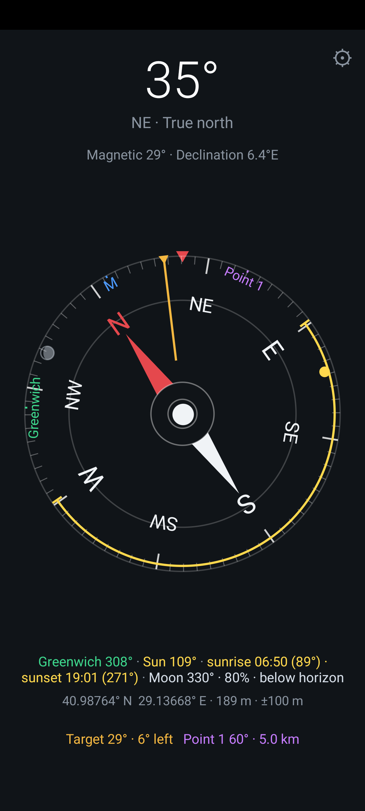
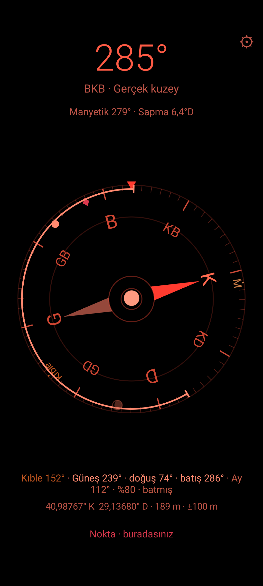
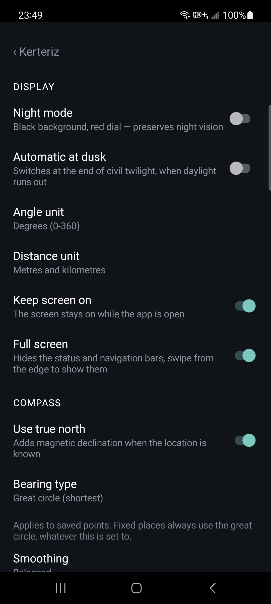

# Kerteriz

[](https://github.com/aripdcom/kerteriz/actions/workflows/ci.yml)

Android için sade bir pusula uygulaması. Dış bağımlılığı yok — sadece Android SDK
ve Kotlin standart kütüphanesi kullanılıyor, kadran `Canvas` ile elle çiziliyor.

Gerçek kuzey, kıble yönü, dokununca yön kilitleyen hedef göstergesi ve kadranın
göbeğinde su terazisi.

**Tanıtım sayfası: https://kerteriz.aripd.com/** (16. bölüm) ·
**Gizlilik: https://kerteriz.aripd.com/privacy/** (13. ve 16. bölüm)

- `minSdk 24` (Android 7.0) — **Android 16 dahil** tüm sürümlerde çalışır
- `targetSdk 36` (Android 16). 35'ten itibaren kenardan kenara çizim zorunlu ve
  `setDecorFitsSystemWindows(true)` yok sayılıyor; pencere boşluklarını uygulama
  kendisi bırakıyor. 36'da bu zorunluluğun muafiyeti de kaldırıldı.
- Paket adı: `com.aripd.kerteriz`
- İzinler: `VIBRATE` (yön geçişi tıkı) ile `ACCESS_COARSE_LOCATION` ve `ACCESS_FINE_LOCATION` (gerçek kuzey, kıble
  ve koordinat paneli için; reddedilirse uygulama manyetik kuzeyle çalışmaya devam
  eder, "yaklaşık" seçilirse koordinatlar o etiketle gösterilir).
- Dışarıdan konum alır: `geo:` bağlantıları ve paylaşılan düz metin (bkz. 5. bölüm).
- **28 dil**: AB'nin 24 resmî dili, İzlandaca, Norveççenin iki yazı dili ve
  Türkçe. Varsayılan İngilizce; uygulama telefonun sistem diliyle açılır
  (bkz. 9. bölüm).

## 0. Klasör düzeni

```
kerteriz/
├── app/          uygulama kaynağı
├── .github/      iş akışları ve yardımcı betikler (bkz. 15. bölüm)
├── dist/         üretilen APK'lar          (gitignore'da)
├── docs/         tanıtım sayfası, gizlilik metni, ekran görüntüleri (16. bölüm)
├── store/        Play'e yüklenecek görseller: ikon, öne çıkan görsel, çekimler (17. bölüm)
├── tools/        depo denetimleri ve yardımcılar (9., 16. ve 17. bölüm)
├── keys/         imzalama anahtarı         (gitignore'da)
└── keystore.properties                     (gitignore'da)
```

| | | |
|---|---|---|
|  |  |  |
| Kadranda altı işaret: mavi **M** manyetik kuzey, yeşil **Greenwich**, altın disk güneş ve yayı, mor baklava kaydedilen nokta, gri disk ay. Altta yönler, koordinat ve hedef satırı. | Gece modu: siyah zemin, kırmızı kadran. Ayrım parlaklıkla değil tonla kurulur, gece görüşü korunur. | Ayarlar: görünüm, pusula davranışı ve hangi işaretlerin görüneceği. Uygulama içinde dil ayarı yoktur, sistem dili kullanılır. |

## 1. Hazır APK'yı telefona kurmak

Derlenmiş APK: `app/build/outputs/apk/debug/app-debug.apk`
(release sürümü ~130 KB; debug sürümü küçültme yapılmadığı için daha büyüktür)

APK'yı kendiniz derlemek zorunda değilsiniz. Her itişte GitHub Actions bir debug
APK üretip koşunun çıktısına asıyor; `v` ile başlayan her etikette de imzalı bir
release APK'sı deponun **Releases** sayfasına düşüyor. İkisinin de nasıl
indirileceği 15. bölümde.

### Yöntem A — Kabloyla, adb ile (en hızlı)

Telefonda önce **geliştirici seçenekleri**ni açın:

1. `Ayarlar → Telefon hakkında → Yapı numarası` üstüne 7 kez dokunun.
2. `Ayarlar → Sistem → Geliştirici seçenekleri → USB hata ayıklama` (USB debugging) → açın.
3. Telefonu USB ile bilgisayara bağlayın, ekranda çıkan **"Bu bilgisayara izin ver"**
   uyarısını onaylayın.

Sonra:

```bash
export ANDROID_HOME=$HOME/Android/Sdk
$ANDROID_HOME/platform-tools/adb devices        # telefon "device" olarak görünmeli
$ANDROID_HOME/platform-tools/adb install -r app/build/outputs/apk/debug/app-debug.apk
```

Doğrudan derleyip kurmak için tek komut da yeterli:

```bash
./gradlew installDebug
```

### Yöntem B — Kablosuz adb (Android 11+, kablo gerekmez)

`Geliştirici seçenekleri → Kablosuz hata ayıklama` → **Cihazı eşleştirme kodu ile eşleştir**:

```bash
adb pair <telefon-ip>:<eşleştirme-portu>     # ekrandaki 6 haneli kodu girin
adb connect <telefon-ip>:<bağlantı-portu>    # kablosuz hata ayıklama ekranındaki port
adb install -r app/build/outputs/apk/debug/app-debug.apk
```

### Yöntem C — Dosyayı telefona kopyalayıp elle kurmak (bilgisayarda adb gerekmez)

APK'yı telefona aktarın (e-posta, Drive, USB bellek, `scp`, ne kolaysa), telefonda
dosya yöneticisinden dosyaya dokunun. Android 13 size **"Bu kaynaktan uygulama
yüklemeye izin ver"** diye soracaktır:

`Ayarlar → Uygulamalar → Özel uygulama erişimi → Bilinmeyen uygulamaları yükle →
(dosya yöneticisi / tarayıcı) → Bu kaynağa izin ver`

İzni verdikten sonra kurulum ekranı açılır. Play Protect "bilinmeyen geliştirici"
uyarısı verirse **Yine de yükle** deyin — kendi imzaladığınız APK olduğu için normaldir.

> Android 13'te, APK'yı bir dosya yöneticisi üzerinden kurduğunuzda uygulama
> "kısıtlı ayarlar" kapsamına girebilir. Erişilebilirlik/bildirim gibi hassas
> ayarlara ihtiyacı olmadığı için bu uygulamada sorun çıkarmaz.

## 2. Kaynaktan derlemek

Gerekli olanlar: JDK 17+ ve Android SDK (platform 34 + build-tools 34.0.0).

```bash
export ANDROID_HOME=$HOME/Android/Sdk
echo "sdk.dir=$ANDROID_HOME" > local.properties   # yoksa oluşturun
./gradlew assembleDebug        # -> app/build/outputs/apk/debug/app-debug.apk
```

Android Studio kullanacaksanız: `File → Open` ile bu klasörü açın, telefonu bağlayın,
yeşil **Run** düğmesine basın — derleme ve kurulum tek adımda yapılır.

### Android SDK'yı komut satırından kurmak (Android Studio olmadan)

```bash
mkdir -p ~/Android/Sdk/cmdline-tools && cd ~/Android/Sdk/cmdline-tools
curl -O https://dl.google.com/android/repository/commandlinetools-linux-16111833_latest.zip
unzip commandlinetools-linux-16111833_latest.zip && mv cmdline-tools latest
export ANDROID_HOME=$HOME/Android/Sdk
yes | $ANDROID_HOME/cmdline-tools/latest/bin/sdkmanager --licenses
$ANDROID_HOME/cmdline-tools/latest/bin/sdkmanager "platform-tools" "platforms;android-34" "build-tools;34.0.0"
```

## 3. Kalıcı kurulum için release APK (önerilir)

Debug APK'ları ortak bir debug anahtarıyla imzalanır. Uygulamayı uzun süre kendi
telefonunuzda tutup güncelleyecekseniz, kendi anahtarınızla imzalanmış bir release
APK üretin — böylece sürüm yükseltmelerinde "imza uyuşmuyor" hatası almazsınız.

```bash
mkdir -p keys
keytool -genkeypair -v -keystore keys/pusula-release.jks -alias pusula \
    -keyalg RSA -keysize 2048 -validity 10000

cat > keystore.properties <<EOF
storeFile=keys/pusula-release.jks
storePassword=...
keyAlias=pusula
keyPassword=...
EOF

./gradlew assembleRelease   # -> app/build/outputs/apk/release/app-release.apk
```

`storeFile` yolu proje köküne göre çözülür, bu yüzden proje klasörünü taşımak
ayarı bozmaz.

`keys/`, `dist/` ve `keystore.properties` `.gitignore`'da — commit etmeyin,
**ve `.jks` dosyasını kaybetmeyin**: uygulamayı güncelleyebilmenin tek yolu odur.
`keystore.properties` yoksa build dosyası bu bloğu sessizce atlar, `assembleDebug`
her koşulda çalışır.

CI'da aynı anahtar kullanılır ama dosya değil **ortam değişkenleri** okunur
(`COMPASS_KEYSTORE_FILE`, `COMPASS_KEYSTORE_PASSWORD`, `COMPASS_KEY_ALIAS`,
`COMPASS_KEY_PASSWORD`). Sebebi `.properties` biçimi: ters bölü orada kaçış
karakteridir, içinde ters bölü geçen bir parola dosyaya yazıldığında sessizce
başka bir parolaya dönüşür ve imzalama "parola yanlış" diyerek kırılır. Kurulumu
15. bölümde.

## 4. Gerçek kuzey ve manyetik kuzey

Uygulama ikisini birden gösterir:

- **Büyük rakam** gerçek (coğrafi) kuzeye göre yöndür — sapma bilinir bilinmez
  buna geçer, bilinmiyorsa manyetik yönü gösterir ve altındaki etiket hangisi
  olduğunu açıkça yazar.
- **Alt satır** manyetik yönü ve o konumdaki sapmayı verir, örn.
  `Manyetik 265° · Sapma 5,8°D`.
- **Kadranda mavi "M" işareti** manyetik kuzeyin nereye düştüğünü gösterir.
  Kadran gerçek kuzeye göre döndüğü için bu işaret K'dan sapma kadar uzakta durur.

Sapma `GeomagneticField(enlem, boylam, rakım, zaman).declination` ile hesaplanır;
doğuya doğru pozitiftir ve `gerçek = manyetik + sapma` formülüyle uygulanır.
Türkiye'de yaklaşık +5° ile +7° arasındadır.

Bunun için yaklaşık konum yeter, o yüzden yalnızca `ACCESS_COARSE_LOCATION`
isteniyor. Konum `LocationManager`'ın en son bilinen konumundan alınır (Google
Play Hizmetleri gerekmez); bulunan sapma `SharedPreferences`'a yazıldığı için
sonraki açılışlarda gerçek kuzey anında gösterilir. İzin verilmezse alt satır
"Gerçek kuzey için konum izni gerekli" yazar ve dokununca izni yeniden ister;
kalıcı reddedilmişse uygulama ayarlarını açar. İzin olmadan da uygulama
manyetik kuzeyle sorunsuz çalışır.

**Manyetik bozulma uyarısı.** Sapma doğru hesaplansa bile, telefonun yakınındaki
bir mıknatıs ya da mıknatıslanmış metal pusulayı sessizce yanıltır: açı yanlıştır
ama ekranda hiçbir şey belli olmaz. Uygulama bunu yakalar — ölçülen toplam alan
şiddetini o konumda beklenenle (`GeomagneticField.getFieldStrength()`) karşılaştırır,
%25'i aşan sapma **kesintisiz 2,5 saniye** sürerse uyarır, %15'in altına inince
uyarıyı hemen kaldırır:

```
Manyetik bozulma: alan 63 µT, beklenen 49 µT — telefonu metal/mıknatıstan uzaklaştırın.
```

Cihazın kendi hassasiyet bayrağı bu durumu genelde fark etmez, çünkü sabit bir
bozulma "kararlı" görünür. Gerçek bir örnek: bilgisayar masasında ölçülen alan
63,3 µT ve manyetik eğim 9,2° idi — İstanbul'un değerleri 48,5 µT ve 58,7°, o eğim
manyetik ekvatora karşılık gelir. Masadan iki metre uzaklaşınca alan 49,5 µT'ye
oturdu ve yön düzeldi. Bu yüzden rotation-vector'e ek olarak ham manyetometre de
dinlenir (`SENSOR_DELAY_UI`): füzyon yönü verir ama alanın büyüklüğünü vermez.

Süre şartının sebebi: telefonu elde çevirirken kalibrasyon geçici olarak %20'ye
varan sapma üretebiliyor. Süre şartı olmadan eşiği düşürmek yanlış alarma yol
açardı; süre şartı geldiği için eşik %30'dan %25'e çekilebildi — masadaki gerçek
vaka %31,9 sapma yapıyordu ve %30 eşiği kıl payı geçiyordu, %25 daha emniyetli. Uyarıdaki sayı da her µT oynamasında değil,
2 µT'yi aşan kaymalarda tazeleniyor. Durum satırı yazı gelip gidince ekranın
kaymaması için yerini her zaman ayırır (`minLines="2"`); aksi hâlde uyarı her
çıkışında kadran zıplıyordu.

## 5. Kıble, hedef kilidi, su terazisi, konum ve nokta

**Sabit yerlere yön.** Konum bilinince seçilen yerler kadranda yeşil işaret ve
üst satırda derece olarak çıkar. **Hiçbiri varsayılan olarak açık değildir**;
`Ayarlar → Sabit yerler` altından seçilir (bkz. 6. bölüm). Hesap, bulunduğunuz
noktadan hedefe giden büyük daire yayının çıkış açısıdır — kıblenin tanımı da
budur, düz haritadaki "sağ alt köşe" yönü değil:

```
θ = atan2( sin Δλ · cos φ₂ ,  cos φ₁ · sin φ₂ − sin φ₁ · cos φ₂ · cos Δλ )
```

Açı gerçek kuzeye göredir. İstanbul'dan ölçülen değerler: Kâbe 152,0°,
Mescid-i Aksa 150,1°, Vatikan 279,7°.

Listede on bir yer var, üç kategoride:

| Kategori | Yerler |
|---|---|
| Seyir | Greenwich Kraliyet Gözlemevi, Nemo Noktası |
| Denizde | Horn Burnu, Agulhas Burnu |
| İbadet yerleri | Kâbe, Mescid-i Aksa, Vatikan, Bodh Gaya, Harmandir Sahib, Kashi Vishwanath, Ise |

Koordinatlar yapıların kendisine aittir ve kaynağın verdiği hassasiyetin
ötesine geçilmez: Horn Burnu dakika mertebesinde yayımlanıyor (ve zaten bir
burun, nokta değil), Nemo Noktası 0,1′ ile hesaplanmış bir nokta.

**Greenwich'te bir incelik var.** Koordinat Airy Geçiş Dairesi'nindir, yani
*tarihî* başlangıç meridyeni. GPS'in sıfır boylamı (IERS Referans Meridyeni)
bunun yaklaşık 102 m doğusundan geçer. Yön olarak binlerce kilometre öteden
102 m görünmez, ama etiket bu yüzden "0° boylam" demiyor, "Greenwich" diyor —
diyen bir uygulama yanlış söylemiş olurdu.

İlk ikisi arasında **yalnızca 1,9° var** ve bu, kadran yerleşiminin tamamını
belirledi. Kadranın kenarında altı ayrı işaret yarışıyor: **M** ve yer yazıları,
güneş diski, ay diski, nokta baklavası. Üç katmanlı çözüm:

1. **Birbirine 6°'den yakın yer işaretleri tek etikette birleşir** (`Kıble·Aksa`),
   konumları vektörel ortalamadan. O çözünürlükte ikisi zaten aynı yöndür; kesin
   dereceler alt satırda yazar.
2. Kalan işaretlerin hepsi — yazılar **ve** semboller — tek bir listede toplanıp
   **yarıçaplara dağıtılır**: 0,94R, 0,855R, 0,79R. Bir işaret, aynı yarıçapta
   açısal genişliklerinin toplamından yakın bir komşu bulursa bir alt kademeye
   iner. Geniş olanlar önce yerleşir, çünkü dar olanlar kalan boşluklara daha
   kolay sığar.
3. Her işaretin açısal genişliği kendi piksel genişliğinden hesaplanır
   (`atan(yarı_genişlik / yarıçap)`), yani uzun bir yazı kısa bir sembolden daha
   çok yer kaplar ve komşularını daha kolay aşağı iter.
4. Ekranın tepesindeki sabit gösterge de bu yarışa katılır: yerinden
   oynatılamadığı için dış halkaya önceden yerleştirilir ve yakınına düşen
   işaretler onun için de bir alt kademeye iner. Aksi hâlde telefonun baktığı
   yöne denk gelen etiket göstergenin altında kalıyordu.

Ekrandaki yazılar da anlamına göre ayrılmıştır: üst satır pusulanın kendi
durumudur (manyetik açı ve sapma), kadranın altındaki satır ise işaretlerin
yönleridir. Hepsi tek satıra dizilince üç sıraya taşıp okunmaz oluyordu; ayrıca
bunlar farklı sorular — "pusula ne diyor" ile "neyin nerede olduğu".

Bu sistem iki ayrı hatadan doğdu. Önce yalnızca yazılar dağıtılıyordu ama
kademeler 0,90 ve 0,845'ti; aradaki 0,055R yazı yüksekliğinden (0,10R) küçük
olduğu için etiketler farklı yarıçapta olmalarına rağmen yine biniyordu. Sonra
semboller hiç dağıtıma girmediği için ay ile kaydedilen nokta üst üste geldi.
Şimdi ikisi de aynı sistemden geçiyor.

**Hedef kilidi.** İki yolu var. Kadrana dokunmak o an baktığınız yönü kilitler;
alt satıra dokunmak ise açıyı **sayıyla girmenizi** sağlar — haritadan okunan bir
kerterizi takip etmek için gereken budur, çünkü dokunarak yalnızca hâlihazırda
baktığınız yön kilitlenebilir. Girilen değer ekrandaki çerçeve ve birimle aynıdır
(manyetik moddayken manyetik, mil seçiliyse mil). Her iki durumda da: sarı bir hat
kadranda o yönü işaretler, alt satır `Hedef 81° · 12° sağa` diye ne kadar
dönmeniz gerektiğini söyler, ±2° içinde `yön tutuyor` yazar. Tekrar dokunmak
bırakır. Kilit `SharedPreferences`'a yazıldığı için uygulamayı kapatıp açsanız
da durur.

Hedef **manyetik** çerçevede saklanır. Sebebi: konum izni sonradan verilirse
sapma devreye girer ve ekrandaki bütün açılar kayar; hedef manyetik olarak
tutulunca kilitlediğiniz fiziksel yön aynı kalır.

**Su terazisi.** Kadranın göbeğindeki kabarcık telefonun eğimini gösterir.
Gerçek terazideki gibi yukarıda kalan tarafa kaçar, ortalanınca telefon düzdür
ve kabarcık beyaza döner. Eğim, remap edilmiş dönüş matrisinin `[8]` elemanının
ark kosinüsüdür (ekran normalinin düşeyden açısı); 40°'yi geçince "telefonu
yatay tutun" uyarısı çıkar, 30°'nin altına inince kaybolur — sınırda titremesin
diye açma ve kapama eşikleri farklı.

**Konum paneli.** Konum bulununca kadranın altında koordinatlar, rakım ve hata
payı görünür:

```
40,98767° K  29,13664° D · 189 m · ±100 m
```

Satıra **dokunmak** biçimi derece-dakika-saniyeye çevirir
(`40°59'15,6" K  29°08'11,9" D`), tekrar dokunmak ondalığa döndürür. **Uzun
basmak** iki seçenek sunar: kopyalamak ya da paylaşmak.

Kopyalanan biçim haritalara yapıştırmaya uygun olsun diye nokta ayraçlı ve
işaretlidir (`40.987670, 29.136640`), ekranda gösterilen biçimden bağımsızdır.
Paylaşılan metne bir de harita bağlantısı eklenir, alıcı koordinatı elle bir
uygulamaya yapıştırmak zorunda kalmasın diye:

```
40.987651, 29.136705
https://www.openstreetmap.org/?mlat=40.987651&mlon=29.136705#map=17/40.987651/29.136705
```

Bağlantı OpenStreetMap'e verilir: hesap istemez, tarayıcıda da açılır. Kaydedilen
noktalar da aynı biçimde paylaşılabilir — listeden noktaya dokunup **Paylaş**
seçildiğinde metnin başına noktanın adı konur. Android 13'ten itibaren sistem kendi kopyalama
onayını gösterdiği için uygulama kendi bildirimini o sürümlerde çıkarmaz.

**Paylaşım çift yönlü.** Uygulama konum gönderebiliyordu ama alamıyordu; oysa
paylaşmanın karşılığı almaktır. Artık bir haritanın "paylaş"ı, bir `geo:`
bağlantısı ya da kopyalanmış bir koordinat doğrudan uygulamaya gönderilip nokta
olarak kaydedilebiliyor. Tanınan biçimler `Coordinates.kt`'te ve hepsinin testi
var:

| Biçim | Örnek |
|---|---|
| Ondalık çift | `41.0, 29.0` |
| `geo:` adresi | `geo:41.0,29.0` · `geo:0,0?q=41.0,29.0(Ev)` |
| OpenStreetMap | `.../?mlat=41.0&mlon=29.0#map=17/41.0/29.0` |
| Google Maps | `.../maps/@41.0,29.0,17z` · `?q=41.0,29.0` |
| Derece-dakika-saniye | `41°00'30"K 29°08'12"D` |

İki incelik ayrıştırmada. `geo:0,0?q=...` kalıbındaki baştaki sıfırlar "konum
belirtilmedi" demektir ve gerçek koordinat sorgunun içindedir; elenmezse her
paylaşım Gine Körfezi'ne düşerdi. Yarımküre harfi ise yalnızca İngilizce ve
Türkçe için tanınır (N/S/E/W ve K/G/D/B): Almancada `O` doğu (Ost), İspanyolcada
batı (Oeste) demek ve yanlış tahmin sessizce yanlış yarımküreye götürür —
tanımamak yanlış tanımaktan iyidir.

Aynı ayrıştırıcı elle giriş için de kullanılır: nokta listesindeki **Koordinat
gir…** düğmesi tek bir alan açar ve yukarıdakilerin hepsini kabul eder.
Kullanıcıya "hangi biçimde istiyorsun" diye sormak yerine eldekini
yapıştırmasına izin veriyor.

Koordinat paneli anlamlı olsun diye artık hassas konum da isteniyor. Kullanıcı
"yaklaşık"ı seçerse uygulama çalışmaya devam eder ve satırın sonuna *yaklaşık*
yazar — hata payı zaten kilometrelerce olur, bunu gizlemek yanıltıcı olurdu.
Sapma için ağ konumu yeterdi; panel için GPS'in hassasiyeti de gerektiğinden
artık iki sağlayıcı da dinlenir ve gelen fix'lerden en iyisi seçilir (bir
dakikadan yeni olan koşulsuz kazanır, eşit yaştakilerde hata payı küçük olan).

**Nokta kaydetme ve geri dönüş.** Kadrana **uzun basmak** bulunduğunuz yeri
kaydeder. Birden çok nokta tutulabilir (en fazla 8): araba, kamp, patika başı
ayrı ayrı. Her biri kadranda **adıyla** görünür ve alt satırda yönü ile mesafesi
yazar:

```
Araba 265° · 1,2 km   Kamp 12° · 340 m
```

Alt satırda adıyla en yakın iki nokta yazar, gerisi `+3 nokta` diye sayılır:
sekiz nokta kayıtlıyken satır beş-altı satıra taşıyor ve `layout_weight`'i 1 olan
kadranın yerini yiyordu. Hiçbir şey kaybolmuyor — hepsi kadranda işaretli ve
listede yön ve mesafesiyle duruyor.

Alt satıra **uzun basmak** listeyi açar; bir noktaya dokununca yeniden
adlandırılabilir, paylaşılabilir ya da silinebilir. Liste boşken de açılır,
çünkü **Koordinat gir…** düğmesinin tek görünür kapısı orası. Yeni noktalar "Nokta 1", "Nokta 2" diye
adlandırılır — sıra numarası listede boş olan ilk numaradır, silinen numaralar
yeniden kullanılır.

Kayıt biçimi bilerek sade: her satır bir nokta, alanlar görünmez bir ayraçla
(U+0001) bölünür. JSON kullanılmadı, çünkü `org.json` Android'in kendi sınıfıdır
ve JVM testlerinde çalışmaz; bu mantığın sınanabilir kalması biçimin
zarafetinden daha değerli. Ayraç ve satır sonu adlardan temizlenir, bozuk satır
atlanır ve diğerleri korunur — yedi test bunu doğrular.

Eski sürümlerde tek nokta iki ayrı anahtarda tutuluyordu; ilk açılışta listeye
taşınır ve eski anahtarlar silinir.

Yön ve mesafe, aşağıdaki **Büyük daire, loksodrom ve deniz mili** başlığındaki
ayarlara uyar; varsayılanda yön kıbleyle aynı büyük daire formülünden, mesafe
`Location.distanceBetween` ile gelir ve bir kilometrenin altında metre, üstünde
kilometre yazar.

Noktanın üstündeyken yön ne yazılır ne de kadranda gösterilir; yalnızca
`Araba · buradasınız` denir. Sebebi: mesafe
konum hatasının altına inince yön anlamını yitirir — hata çemberinin içinde hangi
yöne bakacağınızı söylemek uydurma olur. Eşik fix'in kendi hata payıdır, ama
10-25 m aralığına sıkıştırılır: çok iyi bir fix'te bile birkaç metrede yön
güvenilmez, çok kötü bir fix'te de yüz metre öteye "buradasınız" demek yanlış
olurdu.

Tekrar uzun basmak siler. Nokta `SharedPreferences`'a yazıldığı için uygulamayı
kapatsanız da durur.

Hedef ve nokta bilgisi tek satırda, kadrandaki işaretlerle aynı renklerde
gösterilir; ikisi de yokken satır iki hareketi birden anlatır. Satır iki sıra yer
kaplar (`minLines="2"`), yoksa nokta kaydedildiğinde ekran zıplardı.

Kadranda dört işaret var ve hiçbiri diğerine karışmasın diye hem renk hem şekil
ayrılmış: mavi **M** yazısı manyetik kuzey, yeşil **Kıble** yazısı Kâbe yönü,
altın **disk** güneş, mor **baklava** kaydedilen nokta. İki yazı farklı
yarıçaplara konur (`M` 0,90R, `Kıble` 0,845R). Üçüncü bir yazıya yer yok: yön
harfleri 0,62-0,785R bandını kaplıyor, üstte kalan şerit iki satır ancak alıyor —
bu yüzden güneş ve nokta yazı yerine şekille gösteriliyor, adları zaten
kendi renklerinde alt satırlarda geçiyor.

**Güneş azimutu.** Kadranda altın bir disk güneşin yönünü gösterir, üst satırda
derecesi yazar. Disk doluysa güneş ufkun üstünde, içi boşsa batmıştır — yön yine
bilgidir ama bakacak güneş yoktur.

Bunun asıl değeri çapraz kontrol: **güneşin yönü manyetik alandan tamamen
bağımsızdır.** Pusuladan şüphelenirseniz (yakında metal, kalibrasyon bozuk,
bozulma uyarısı çıkmış) güneşe bakıp kadranı sınayabilirsiniz. Bugünkü masa
vakasında olduğu gibi manyetik alan bozukken bu, yönü kurtaran tek referanstır.

Hesap NOAA'nın güneş konumu algoritmasıdır (`Sun.kt`, saf Kotlin, ~70 satır) ve
tamamen UTC üzerinden yürür: gerçek güneş saati, boylamın her derecesi 4 dakika
sayılarak ve zaman denklemi eklenerek doğrudan UTC'den kurulur. Bu yüzden cihazın
**saat dilimi ayarının yanlış olması sonucu etkilemez**; yalnızca saatin kendisi
doğru olmalıdır. Güneş dakikada 0,25° yol aldığı için konum dakikada bir tazelenir.

**Güneşin yolu.** Kadranın kenarındaki altın yay, güneşin bugün doğduğu yönden
battığı yöne, güneyin üzerinden uzanır; uçlarındaki çentikler doğuş ve batış
noktalarıdır. Alt satırda **hem saatleri hem yönleri** yazar:

```
doğuş 06:21 (74°) · batış 19:50 (286°)
```

Saat biçimi cihazdan gelir (12/24 saat tercihi ve dil sistemin), uygulamanın
kendi biçimi yoktur. Güneş diski bu yayın üzerinde
ilerler.

"Güneş doğudan doğar" yalnızca ekinokslarda doğrudur. İstanbul'da doğuş noktası
yıl boyunca **64°'lik bir yay** tarar:

| Tarih | Sapma | Doğuş | Batış |
|---|---|---|---|
| 21 Haziran | +23,4° | 57,3° | 302,7° |
| 21 Mart / 23 Eylül | 0° | 89,3° | 270,7° |
| 21 Aralık | −23,4° | 121,0° | 239,0° |

Ekinoksta bile tam 90° değil 89,3°, çünkü güneş merkezi ufkun 0,833° altındayken
görünür: atmosferik kırılma 34′ yukarı kaldırır, güneşin yarıçapı 16′ ekler.
Saatler de bu tanıma göre hesaplanır.

Yön ile saat ayrı formüllerden gelir — biri azimutu, diğeri saat açısını çözer —
ve hesap bir kez yinelenir: deklinasyon gün içinde değiştiği için tek geçişte
bulunan an yarım dakikaya varan hata veriyordu.

**Gün yerel güneş gününe demirlenir, UTC gününe değil.** Bu bir hatanın
düzeltilmesiydi: gün UTC gece yarısından hesaplanıyordu ve boylam büyüdükçe iki
gün ayrışıyordu. Auckland'da (UTC+13) yerel sabah saat 09:00 UTC'de bir önceki
güne düştüğü için uygulama dünün doğuşunu ve çoktan geçmiş bir batış saatini
gösteriyordu. Referans an artık boylam kadar (derece başına 4 dakika) kaydırılıp
öyle tabana yuvarlanıyor; saat hesabındaki formül zaten `-4·boylam` içerdiği
için kaydırma yalnızca gün seçimine giriyor. İki test bunu bekliyor: doğuş ile
batışın orta noktası yerel öğledir ve referans an ondan en çok 12 saat uzakta
olmalıdır. Aynı sebeple doğuş ile batış
kuzey-güney eksenine göre **tam simetrik değildir**; sabah ile akşam arasında
deklinasyon değiştiği için iki uç birkaç yüzde bir derece kayar. Bu
yayın genişliği enlemle büyür — ekvatorda 47°, İstanbul'da 64°, 60°K'de 106°,
kutup dairesinde 161°. Kutup gündüzü ya da gecesinde güneş ufku hiç kesmez;
formülün kosinüsü ±1'i aştığı için yay o günlerde çizilmez.

Yay bilinçli olarak **etiketsiz**: tek bir öğe hem iki uç noktayı hem de yolu
anlatıyor ve kadranın yazı bütçesini harcamıyor.

Doğrulama: uygulama 162° gösterirken bağımsız bir formülasyon (Astronomical
Almanac, saat açısını zaman denklemi yerine GMST'den kuran yol) 162,0° verdi.
Yan kontroller de tuttu — 23 Ağustos için deklinasyon 11,37° (beklenen ~11,5°),
o gün İstanbul'da güneşin azami yüksekliği 60,4°.

**Yön geçişlerinde titreşim.** Ana yönlerden (K/D/G/B) geçerken kısa bir tık,
kilitli hedeften geçerken **çift** tık verilir. Ekrana bakmadan yön tutmaya
yarar — gece görüşünü koruyan asıl şey de bu, çünkü ekrana her bakış onu baştan
bozuyor. Görme engelli kullanıcı için kadranın tek hissedilebilir karşılığı.

İki efektin ayrı olması şart: aynı tık olsalardı "kuzeyden mi geçtim yoksa
hedefe mi girdim" ayırt edilemezdi, oysa bakmadan yön tutmanın bütün anlamı o
ayrımda. Çift tıkın iki darbesi arasında 60 ms var; daha kısası ERM motorunun
duracak vakit bulamaması yüzünden tek uzun titreşime karışıyor. **Cihazda
doğrulandı** (Galaxy A51 / Android 13): 60 ms bu motorda yetiyor, iki efekt elde
rahatça ayırt ediliyor. Bu bölümün geri kalanının anlattığı sebeple ölçüm şart
oldu — aynı cihazda `dumpsys` kaydının düşmesi de `performHapticFeedback`'in
`true` dönmesi de titreşimin hissedildiği anlamına gelmiyordu.

Uygulama açılırken bir yöne bakıyorsanız titremez — ilk okuma yalnızca başlangıç
bölgesini kaydeder. Algılamanın kendisi `Crossing.kt`'te ve sekiz testi var.

Titreşim `performHapticFeedback` ile değil, doğrudan `Vibrator` ile verilir
(45 ms, tam genlik). Karşılığında `VIBRATE` izni gerekir (normal izin, çalışma
anında sorulmaz) ve kullanıcının sistem dokunsal ayarına elle bakılır: kapalıysa
titremez.

Bu iki sayı deneyle bulundu ve ikisi de aynı fiziksel sebebe çıkıyor. Önce
`performHapticFeedback` sabitleri denendi: Galaxy A51 / Android 13'te
`CLOCK_TICK`, `KEYBOARD_TAP`, `VIRTUAL_KEY`, `CONFIRM` ve `CONTEXT_CLICK`
**hepsi `true` dönüyor ama hiçbiri titremiyor**; çalışan tek sabit 48 ms'lik
`LONG_PRESS`. Yani dönüş değeri bu cihazda hiçbir şey ifade etmiyor.

"48 ms fazla sert" diye kendi efektimiz 20 ms verildiğinde `dumpsys
vibrator_manager` kaydı düzgün düşüyordu ama elde hiçbir şey hissedilmiyordu.
Sebep: A51'in motoru **ERM** (dönen ağırlık) ve dönmeye başlaması 30-50 ms
alıyor — 20 ms'lik darbe motoru hızlandırmaya yetmiyor. `LONG_PRESS`'in tek
çalışan sabit olması da tesadüf değilmiş, eşik tam orada. Cihazın dokunsal
şiddeti `TOUCH=(LOW)` olduğu için varsayılan genlik ayrıca kısılıyordu, o yüzden
genlik açıkça 255 veriliyor.

Buradan çıkan genel ders: titreşim kaydının `dumpsys`'te görünmesi hissedildiği
anlamına gelmiyor, `performHapticFeedback`'in `true` dönmesi de öyle. İkisi de
bu cihazda sessizce yalan söyledi; tek geçerli doğrulama telefonu eline alıp
denemek oldu.

Art arda tetiklemeye karşı 700 ms'lik asgari aralık var. Bu da ölçümden geldi:
açılışta yumuşatma otururken açı birkaç bölgeyi hızla kesip 23 ms içinde üç tık
üretmişti.

**Gece modu.** Büyük derece yazısına dokunmak ekranı gece moduna alır: zemin tam
siyah, her şey kırmızı. Tekrar dokunmak geri döndürür, seçim kalıcıdır.

Ayarlardan **alacakaranlıkta otomatik** açılabilir. Ölçüt batış değil sivil
alacakaranlığın sonu (güneş yüksekliği -6°): güneş battıktan sonra yirmi dakika
kadar okumaya yetecek ışık kalır, kırmızıya orada geçmek erken olurdu. -6°'de
doğal ışık biter ve göz karanlığa uyum sağlamaya başlar — kırmızının bütün
gerekçesi bu. Uygulama batışı zaten hesapladığı için ek bir maliyeti yok.

Elle yapılan her seçim (dereceye dokunmak ya da ayarlardaki anahtar) otomatiği
kapatır: aksi hâlde anahtar bir dakika sonra kendiliğinden geri döner ve arıza
gibi görünürdü. Varsayılan kapalı, aynı sebeple — beklemeyen biri için ekranın
kendiliğinden kırmızıya dönmesi bir arıza gibi okunur.

Sebebi göz fizyolojisi: karanlığa uyum sağlamış göz kırmızı ışıktan neredeyse hiç
etkilenmez, ama mavi-yeşil ışık uyumu saniyeler içinde bozar ve yeniden karanlığa
alışmak yarım saat sürer. Gece yön bulurken ekrana her bakışta gece görüşünü
baştan kaybetmemek için kadran tümüyle kırmızıya çevrilir; zemin de tam siyah
olur, ekran ne kadar az ışık verirse o kadar iyi.

Bedeli şu: gece modunda işaretler **renkle ayırt edilemez**, çünkü hepsi aynı
tonun farklı parlaklıklarıdır. Bu yüzden şekil ayrımı burada işe yarıyor — güneş
disk, nokta baklava, manyetik kuzey ile kıble ise yazı. Renk düzeni tek yerde
(`Palette.kt`) tanımlıdır ve iki hâli vardır; hem kadran hem yazılar aynı
paletten beslenir, o yüzden geçiş tek satırdır.

**Ay.** Kadranda yönü, evresi diskin doluluğuyla çizilir; ufkun altındaysa soluk
kalır. Gece modunun tam tamamlayıcısıdır: ay çıkmışsa gece yön bulmanın en
pratik referansıdır ve güneş gibi manyetik alandan bağımsızdır.

Hesap güneşten belirgin biçimde zordur. Güneşin yörüngesi tek bir elipsle iyi
yaklaşılırken ay, Dünya ile Güneş arasında sürekli çekiştiği için düzensiz
hareket eder; bozulma (perturbation) terimleri olmadan hata 2°'ye kadar çıkar.
En büyük ikisi evection (1,274°) ve variation (0,658°) terimleridir. Ayrıca ayın
paralaksı ihmal edilemez (~1°), çünkü ay yakındır ve gözlemci Dünya'nın
merkezinde değil yüzeyindedir — yükseklik buna göre düzeltilir, yoksa ufka yakın
ayın "doğdu mu battı mı" kararı yanlış çıkar.

Doğrulama fiziksel sabitlerle yapıldı: yıldızıl ay 27,33 gün (olması gereken
27,32), ekliptik enlem en çok 5,29° (sınır 5,3), uzaklık 57,0-63,6 Dünya yarıçapı
(55,9-63,8), deklinasyon en çok 28,4° (sınır 28,7). Bilinen bir yeni ay anında
(JD 2451550,09766) uzanım 358,2°, aydınlık %0,02.

İlk denemede epok yanlıştı: Schlyter'in gün sayısı 2000 Ocak 0,0'dan, yani
31 Aralık 1999 00:00 UT'den (JD 2451543,5) başlar. JD 2451545,0 (1 Ocak öğlen)
kullanmak 1,5 günlük kayma, o da ayın yerinde 18° hata demekti — yeni ay testi
bunu ilk denemede yakaladı.

Ay simgesi, kadranın diğer işaretlerinin aksine **kadranla birlikte
döndürülmez**. Evre şekli yönlü bir simgedir; işaret kadranın dibine düştüğünde
180° dönüp aynalanıyor ve büyüyen ay küçülen gibi görünüyordu. Konumu açıdan
hesaplanıp simge ekrana dik çiziliyor.

### Büyük daire, loksodrom ve deniz mili

Kaydedilen noktaların yönü iki ayrı soruya cevap verebilir ve ikisi aynı sayı
değildir.

**Büyük daire** (varsayılan) en kısa yolu verir. Kıblenin tanımı da budur. Ama o
yolun pruvası yol boyunca döner: dümende tutulacak tek bir sayı vermez. New
York'tan Lizbon'a 70°'den çıkılır, 114°'te varılır.

**Loksodrom** (sabit pruva) baştan sona değişmeyen açıyı verir. Biraz uzundur,
buna karşılık bir kez söylenir ve varana kadar geçerlidir; seyir haritası
geleneğinin kullandığı yol budur. Aynı New York-Lizbon yolu için 92°.

Ayar **kerteriz türü** adıyla Ayarlar → Pusula altında. Yalnızca kaydedilen
noktalara işler; **sabit yerler her hâlükârda büyük dairede kalır**, çünkü
kıblenin tanımı odur — bir ayarın onu sessizce değiştirmesi uygulamaya yanlış
söyletmek olurdu.

Ayardaki not bunu söylerken kıbleden söz etmiyor; yalnızca "sabit yerler bu
ayar ne olursa olsun büyük dairede kalır" diyor. Gerekçe yanlış olduğu için
değil: ayarlar ekranı mağaza ekran görüntülerine giriyor ve mağaza tarafında
dini motif geçmiyor (17. bölüm). Gerekçe bu yüzden burada duruyor, uygulamanın
içinde değil — ilk yazımda uygulamanın içindeydi ve doğrudan mağaza karesine
düştü.

Loksodrom seçilince **mesafe de o yola göre** yazılır, en kısa yola göre değil.
İkisini karıştırmak sayıyı bozacak kadar büyük bir fark: Horn Burnu'ndan Agulhas
Burnu'na en kısa yol 6722 km, sabit pruvayla 7110 km — 389 kilometre.

Hesap kürede değil **WGS-84 elipsoidinde** yapılıyor, çünkü uygulamanın
mesafeleri zaten `Location.distanceBetween`'den, yani o elipsoitten geliyor;
ikisinin ayrı yer şekli kullanması tutarsızlık olurdu. Bedeli ölçüldü: kürede
hesaplamak kerterizi İstanbul'dan Kâbe'ye altı dakika, en kötü hâlde on bir
dakika kaydırıyor. Elipsoidin meridyen yayının kapalı biçimi olmadığı için seri
açılımı e⁸'e kadar alındı; çeyrek meridyende (10.002 km) hata onda bir
milimetrenin altında.

İki incelik koda yazıldı:

- **Kutup.** Loksodromun dayandığı izometrik enlem kutupta sonsuza gider ve
  `tan(π/2)` Double'da sonsuz çıkmaz — 1,6×10¹⁶ çıkar, logaritması da makul
  görünen sessizce yanlış bir sayı verirdi. Kutup elle ayrılıyor; kayıt biçimi
  ±90°'ye izin verdiğine göre oraya bir nokta konabilir.
- **"Buradasınız" kararı** her hâlükârda en kısa yola bakar. Varış bir yakınlık
  sorusudur, hangi yoldan gidileceği sorusu değil; uzun yol yüzünden karar geç
  verilseydi noktanın üstünde dururken hâlâ yön gösterilirdi.

**Mesafe birimi** ayrı bir ayar (Ayarlar → Görünüm): metre/kilometre ya da
metre/deniz mili. Deniz milinde eşik bir deniz milidir (1852 m) — altında metre
yazmak hem daha okunur hem daha hassas, çünkü "0,3 NM" beş yüz elli metrelik bir
aralığı tek basamağa sıkıştırırdı.

## 6. Ayarlar

Sağ üstteki dişliden açılır. Dış bağımlılık olmadığı için `PreferenceFragment`
yok; arayüz kodla kuruluyor ve aynı paleti kullanıyor, yani gece modunda
ayarlar ekranı da kırmızıya dönüyor. İskelet ve satır kurucuları
`RowsActivity`'de: iki ekran (Ayarlar ve Sabit yerler) aynı satırları
kullanıyor ve ikincisi için yüz elli satır kopyalamak, er geç ikisinin
ayrışması demekti.

| Ayar | Ne yapar |
|---|---|
| **Gece modu** | Siyah zemin, kırmızı kadran. Büyük derece yazısına dokunmak da aynı işi yapar. |
| **Alacakaranlıkta otomatik** | Gece modunu güneşin yüksekliğine bağlar; sivil alacakaranlığın sonunda (-6°) geçer. Elle yapılan her seçim bunu kapatır. |
| **Açı birimi** | Derece (0-360) ya da NATO mili (0-6400). Bütün yön yazılarını etkiler; sapma derecede kalır, çünkü konumun fiziksel özelliğidir. |
| **Mesafe birimi** | Metre/kilometre ya da metre/deniz mili. Deniz milinde eşik 1852 m'dir. |
| **Ekranı açık tut** | `FLAG_KEEP_SCREEN_ON`. Kapatılabilir olması pil için önemli. |
| **Tam ekran** | Durum ve gezinme çubuklarını gizler; kenardan kaydırınca geçici olarak geri gelirler. Kazanılan yer doğrudan kadranın çapına gider. |
| **Gerçek kuzeyi kullan** | Kapatılırsa kadran manyetik kuzeye oturur. |
| **Kerteriz türü** | Büyük daire (en kısa) ya da loksodrom (sabit pruva). Yalnızca kaydedilen noktalara işler; sabit yerler büyük dairede kalır. Loksodromda mesafe de o yola göre ölçülür. Ayrıntısı 5. bölümde. |
| **Yumuşatma** | Sakin (0,35 sn) / Dengeli (0,17 sn) / Çevik (0,08 sn). Saklanan şey katsayı değil **zaman sabiti**; gerekçesi 11. bölümde. Ortadaki, uygulamanın başından beri kullandığı 0,12 katsayısının 50 Hz'deki karşılığıdır. |
| **Yön geçişlerinde titreşim** | Hem ana yön tıkını hem hedef çift tıkını kapatır. |
| **Kadran işaretleri** | Manyetik kuzey (M), su terazisi, güneş, güneşin yolu ve ayı ayrı ayrı açar/kapatır. |
| **Sabit yerler** | Kendi ekranını açar; altında seçilenlerin kadran etiketleri yazar, hiçbiri seçili değilse "Yok". |
| **Hareketler** | Hakkında bölümünde; her dokunuş ve uzun basışın ne yaptığını tek diyalogda sayar. Yedi gizli hareket yalnızca bu belgede yazıyordu, uygulamanın içinde hiçbir yerde. |

Hedef ve nokta işaretleri o listede yok, çünkü zaten kadrana dokunarak ya da uzun
basarak açılıp kapanıyorlar; ayrıca bir anahtar koymak "kilitli ama görünmez
hedef" gibi kafa karıştırıcı bir durum üretirdi.

### Sabit yerler ekranı

On bir yer, ayarların ortasında on bir anahtar satırı olarak duruyordu ve liste
ancak uzayacak. Kendi ekranına taşındılar: kategorili, arama kutulu ve hepsi
kapalı başlayan bir liste.

Arama aksanı ve büyük/küçük harfi yok sayar — "kabe" yazan **Kâbe**'yi bulur.
Harf katlaması `PlaceSearch.kt`'te ve ekrandan ayrı tutuldu, çünkü saf metin
işlemi ve JVM testinden koşturulabiliyor. Küçültme cihazın diliyle değil
`Locale.ROOT` ile yapılıyor: Türkçe yerelinde `I` harfi `ı`ya düşer ve "kashi"
yazan **Kashi**'yi bulamazdı, yani uygulamanın dilini Türkçe yapmak aramayı
bozardı. NFD'nin ayrıştırmadığı harflerin (`ø`, `æ`, `ł`, `đ`, noktasız `ı`)
karşılıkları elle veriliyor.

Ekran bir sınırı da açıkça söylüyor. Kadranın kenarında yazılar için **üç
kademe** var (`RIM_RADII`) ve bunları manyetik kuzey, güneş, ay ve kaydedilen
noktalar da paylaşıyor; sığmayan işaret en içteki kademeye düşüyor, yani
sessizce bir başkasının üstüne biniyor. Üçüncüden sonrası için uyarı beliriyor
ama **engellenmiyor**: kullanıcı ne yaptığını bilerek dördüncüyü açabilmeli.
Sayı iki yerde yazılı olmasın diye `Places.COMFORTABLE` sabiti var ve bir test
onu `RIM_RADII`nin uzunluğuna bağlıyor.

Kuzey türü ayarı göründüğünden daha derin: sabit yerler, güneş ve nokta **gerçek kuzeye
göre** hesaplanır, kadran ise manyetik kuzeye oturmuş olabilir. Bu yüzden her
işaret çizilmeden önce `toDialFrame()` ile kadranın çerçevesine çevrilir — manyetik
moddayken sapma kadar geri alınır. Manyetik moddayken kadranın "M" işareti de
gizlenir, çünkü kuzeyle çakışır ve bilgi vermez.

Ayarlar ile ana ekran aynı `SharedPreferences` dosyasını paylaşır; anahtarlar
`Prefs.kt`'te toplanmıştır. Ana ekran `onResume`'da hepsini yeniden okuyup
uyguladığı için ayrı bir "kaydet" adımı yoktur.

## 7. Kodun yapısı

Uygulama hem dikey hem yatay çalışır. `remapCoordinateSystem` zaten sensör
eksenlerini ekran yönüne göre eşlediği için okuma her iki yönde de **ekranın üst
kenarının** baktığı yönü verir; telefonu yan çevirince açı 90° kayar, çünkü artık
farklı bir kenar öne bakmaktadır. Yatay yerleşim ayrı bir dosyada (`layout-land/`),
kimlikler aynı olduğu için kod değişmez.

| Dosya | İş |
|---|---|
| `app/src/main/java/com/aripd/kerteriz/MainActivity.kt` | Sensör okuma, açı hesabı, yumuşatma, konum/sapma/kıble, hedef kilidi |
| `app/src/main/java/com/aripd/kerteriz/CompassView.kt` | Kadranın `Canvas` ile çizimi: ibre, işaretler, su terazisi |
| `app/src/main/java/com/aripd/kerteriz/Sun.kt` | Güneşin azimut, yükseklik, doğuş ve batış yönleri (NOAA) |
| `app/src/main/java/com/aripd/kerteriz/Moon.kt` | Ayın azimut, yükseklik ve evresi (Schlyter) |
| `app/src/main/java/com/aripd/kerteriz/Places.kt` | On bir sabit yerin koordinatları ve kategorileri |
| `app/src/main/java/com/aripd/kerteriz/PlaceSearch.kt` | Yer aramasının harf katlaması (aksan, noktasız ı) |
| `app/src/main/java/com/aripd/kerteriz/Waypoints.kt` | Kaydedilen noktaların saklanması |
| `app/src/main/java/com/aripd/kerteriz/Geo.kt` | Yön, açı ve birim dönüşümleri; büyük daire ve loksodrom (Android'e dokunmaz) |
| `app/src/main/java/com/aripd/kerteriz/RimLayout.kt` | Kadran işaretlerinin yarıçap dağıtımı |
| `app/src/main/java/com/aripd/kerteriz/Marks.kt` | Yakın işaretlerin tek etikette birleştirilmesi |
| `app/src/main/java/com/aripd/kerteriz/Smoothing.kt` | İbrenin alçak geçiren süzgeci |
| `app/src/main/java/com/aripd/kerteriz/Crossing.kt` | Bir yönün üzerinden geçişin algılanması (titreşim) |
| `app/src/main/java/com/aripd/kerteriz/Disturbance.kt` | Manyetik anomali algılama ve histerezisi |
| `app/src/main/java/com/aripd/kerteriz/Fixes.kt` | Hangi konum düzeltmesinin kazandığı, "buradasınız" eşiği |
| `app/src/main/java/com/aripd/kerteriz/Coordinates.kt` | Paylaşılan metinden koordinat okuma |
| `app/src/main/java/com/aripd/kerteriz/Palette.kt` | Gündüz ve gece renk düzenleri |
| `app/src/main/java/com/aripd/kerteriz/Prefs.kt` | Ayar anahtarları ve varsayılanları |
| `app/src/main/java/com/aripd/kerteriz/RowsActivity.kt` | İki ayar ekranının ortak iskeleti ve satır kurucuları |
| `app/src/main/java/com/aripd/kerteriz/SettingsActivity.kt` | Ayarlar ekranının içeriği |
| `app/src/main/java/com/aripd/kerteriz/PlacesActivity.kt` | Sabit yer seçimi: kategorili, aranabilir liste |
| `app/src/main/res/layout/activity_main.xml` | Dikey yerleşim: yazılar üstte, kadran altta |
| `app/src/main/res/layout-land/activity_main.xml` | Yatay yerleşim: yazılar solda, kadran sağda |

Nasıl çalışıyor:

- Öncelik `TYPE_ROTATION_VECTOR` sensöründe; cihazda yoksa ivmeölçer + manyetometre
  ikilisine düşülür (`getRotationMatrix`).
- `remapCoordinateSystem` ile sensör eksenleri ekran yönüne göre eşlenir.
- Açı doğrudan değil, `sin`/`cos` bileşenleri üzerinden yumuşatılır — aksi hâlde
  359° → 0° geçişinde ibre bir tam tur atardı. Süzgeç `Smoothing.kt`'te; saklanan
  şey katsayı değil zaman sabitidir ve katsayı her örnekte gerçek aralıktan
  hesaplanır, böylece örnekleme hızı değişse de ibrenin hissi sabit kalır
  (gerekçesi 11. bölümde).
- Aynı `getOrientation` çağrısının `[1]` ve `[2]` değerleri (pitch/roll) su
  terazisini besler; onlar da aynı süzgeçten geçer.
- Sensör hassasiyeti düştüğünde ekranda kalibrasyon uyarısı çıkar (telefonu havada
  8 çizer gibi hareket ettirmek düzeltir). Kalibrasyon uyarısı, eğim uyarısından
  önceliklidir.
- Durum satırında öncelik sırası: manyetik bozulma > kalibrasyon > eğim. Bozulma
  en tehlikelisidir, çünkü diğer ikisinin aksine hiçbir görsel ipucu vermez.
- Kadrandaki işaret renkleri tek yerde (`Palette.kt`) tanımlıdır; ekrandaki
  yazılar da aynı renkleri kullanır, böylece hangi satırın hangi işarete ait
  olduğu bakınca anlaşılır.
- `onDraw` kare başına tahsis yapmaz: kadran harfleri, "M" etiketi ve yoğunluk
  bir kez okunur, `Path`/`RectF` yeniden kullanılır, kenar işaretleri bir
  havuzdan doldurulur ve yarıçap dizisi üst sınırdan ayrılır. Lint'in
  `DrawAllocation` denetimi bunu doğruluyor.

## 8. Erişilebilirlik

**Kontrast.** Bütün yazı renkleri kendi zeminine karşı en az **4,5:1** verir (WCAG
AA); 52sp'lik derece yazısı için eşik 3:1'dir ve 18,5:1 ile fazlasıyla aşar.
Grafik öğeler (ibrenin güney yarısı gibi) 3:1 eşiğine tabidir.

Ölçüm beş eksik buldu: gündüz paletinde ipucu yazısı 4,0:1, gece paletinde ise
soluk yazı 4,1, ipucu 2,7, kıble 3,4 ve nokta 2,9. Gece paletini düzeltmek
tasarımı değiştirmeyi gerektirdi: renkleri eşiğe kadar aydınlatınca **parlaklık
kademeleriyle kurulan ayrım kayboluyordu**, hepsi aynı kırmızıya yapışıyordu.
Çözüm ayrımı parlaklıktan **tona** taşımak oldu — kıble turuncuya (20°), nokta
mora (352°), manyetik kuzey kehribara kaydı. Hepsi hâlâ kırmızı ailesinde, yani
gece görüşü korunuyor, ama artık hem okunuyorlar hem birbirinden ayrılıyorlar.

**Ekran okuyucu.** TalkBack ham metni yanlış okuyordu: "284°" derece işaretini her
zaman söylemiyor, "BKB" ise harf harf okunuyordu. Artık açıklamalar açık yazılıyor:

```
285°                          -> "285 derece, batı kuzeybatı, Gerçek kuzey"
Manyetik 278° · Sapma 6,4°D   -> "Manyetik 278 derece, sapma 6,4 derece doğuya"
```

Yön kısaltması satırı erişilebilirlik ağacından çıkarıldı, çünkü aynı bilgi
derece yazısının açıklamasında zaten var; iki kez okunması gereksiz gürültüydü.

Kadranın iki hareketi de adıyla bildiriliyor: varsayılan "etkinleştir" ve "uzun
bas" etiketleri ne yaptıklarını söylemediği için `onInitializeAccessibilityNodeInfo`
ile "yönü kilitle" ve "nokta kaydet" olarak adlandırıldılar.

Uyarı satırı **canlı bölge** (`accessibilityLiveRegion="polite"`): manyetik
bozulma, kalibrasyon ve eğim uyarıları belirdiklerinde kendiliğinden okunur.
Uyarılar seyrek olduğu için bu gürültü yaratmaz — ama açı için aynısını yapmak
saniyede birkaç kez konuşmak olurdu, o yüzden açı yalnızca odaklanınca okunur.

Ayarlarda her satır tek odak durağıdır. Önce üç duraktı (başlık, açıklama,
anahtar); artık yazılar anahtarın açıklamasına taşınıyor ve satır durumuyla
birlikte okunuyor: *"Gece modu. Siyah zemin, kırmızı kadran — gece görüşünü korur.
Kapalı."*

**Dokunma hedefleri** en az 48dp: dişli düğmesi ve ayar satırları buna göre
büyütüldü.

## 9. Diller

Uygulama **yirmi sekiz dilde**:

| | |
|---|---|
| AB'nin 24 resmî dili | Bulgarca, Çekçe, Danca, Almanca, Yunanca, İngilizce, İspanyolca, Estonca, Fince, Fransızca, İrlandaca, Hırvatça, Macarca, İtalyanca, Litvanca, Letonca, Maltaca, Felemenkçe, Lehçe, Portekizce, Romence, Slovakça, Slovence, İsveççe |
| Kuzey ülkelerinin ekledikleri | İzlandaca, Norveççe **bokmål** ve **nynorsk** |
| Uygulamanın ilk dili | Türkçe |

Uygulama içinde dil ayarı yoktur — sistemde hangisi seçiliyse o kullanılır.
Android 13'ten itibaren `locales_config.xml` sayesinde
`Ayarlar → Uygulamalar → Kerteriz → Dil` altında uygulamaya özel bir seçici de
çıkar.

Varsayılan (`values/`) **İngilizce**, Türkçe ise `values-tr/` altındadır. Sebep:
listede olmayan bir dil seçildiğinde (Japonca, Arapça…) uygulama varsayılana
düşer; orada Türkçe olsaydı o kullanıcılar okuyamadıkları bir dille karşılaşırdı.

Çeviri yalnızca cümleleri değil, **yön sisteminin kendisini** kapsar. Kısaltmalar
dilden dile değişir ve bunlar kadranın üstünde de yazılıdır:

| | Kuzey | Doğu | Batı | Kuzeydoğu |
|---|---|---|---|---|
| İngilizce | N | E | W | NE |
| Türkçe | **K** | **D** | **B** | KD |
| Fransızca | N | E | **O** (ouest) | NE |
| Almanca | N | **O** (Ost) | W | **NO** |
| İtalyanca / İspanyolca | N | E | **O** | NE |
| İsveççe / Danca | N | **O** / **Ø** | V | NO / NØ |
| Çekçe / Slovakça | **S** (sever) | **V** (východ) | **Z** (západ) | SV |
| Lehçe | N | E | W | NE |
| Macarca | **É** | **K** | **Ny** | ÉK |
| Fince | **P** | **I** | **L** | **KO** (koillinen) |
| Yunanca | **Β** | **Α** | **Δ** | ΒΑ |
| Bulgarca | **С** | **И** | **З** | СИ |
| Maltaca | **T** (tramuntana) | **L** (lvant) | **P** (punent) | **G** (grigal) |

Aynı harf dilden dile zıt yöne bakabiliyor: Almanca'da **O** doğu, Fransızca'da
batı; Çekçe'de **S** kuzey, İsveççe'de güney; Fince'de **L** batı (länsi),
Estonca'da güney (lõuna). Bu yüzden yön harfleri kodda gömülü olamazdı; hepsi (kadran harfleri, 16 kısaltma, koordinatların yarım küre
harfleri, sapmanın yön eki) kaynak dosyalara taşındı. Ondalık ayracı da dile
uyar: aynı sapma İngilizce'de `6.4°E`, Almanca'da `6,4°O` yazar.

Bazı dillerde ara yönlerin **kendi adları** var, iki yönün birleşimi değiller:
Fince `koillinen` (kuzeydoğu), `kaakko`, `lounas`, `luode`; Estonca `kirre`,
`kagu`, `edel`, `loe`. Maltaca ise Akdeniz rüzgârlarının adlarını kullanır:
`grigal` (KD), `xlokk` (GD), `lbiċ` (GB), `majjistral` (KB). Maltaca'da
kuzeybatı kadranda `Mj` yazar — `M` manyetik kuzeyin işareti olduğundan tek
harfe bırakılmadı, yoksa kadranda iki ayrı şey aynı harfle görünecekti.

Ekran okuyucu için kullanılan açık yön adları da her dilde ayrıdır
(`kuzey kuzeydoğu` / `north-northeast` / `Nordnordost` / `pohjoiskoillinen`).

### Çevirilerin denetimi

Yirmi sekiz dosyanın elle tutulmasında gözden kaçması en kolay üç hata ne
derlemeyi kırar ne de testlerde görünür:

- **eksik anahtar** — Android o metinde varsayılana düşer, ekranın yarısı bir
  dilde yarısı İngilizce çıkar;
- **bozuk biçim belirteci** — `%1$d` yerine `%1$s` yazıldığında uygulama o
  satırı çizerken çöker, hem de yalnızca o dildeki cihazlarda;
- **dizi uzunluğunun tutmaması** — on altı kısaltma yerine on beşi olan bir
  dilde kadran çizilirken dizi taşar.

Üçünü de `tools/check-translations.py` yakalar ve CI'da her itişte koşar:

```bash
python3 tools/check-translations.py
# 28 dil, 118 metin, 3 dizi — hepsi tutuyor.
```

Betik ayrıca `locales_config.xml` ile `values-*` klasörlerinin aynı kümeyi
gösterdiğini sınar: listede olup çevirisi olmayan bir dil, sistemin dil
seçicisinde görünür ama uygulama İngilizce açılır.

## 10. Boyut

Release APK **351.142 bayt** (~343 KB, sürüm 5.1 — Releases sayfasındaki
imzalı dosya). Bunun yaklaşık dörtte üçü yirmi sekiz dilin metinleri.

Aşağıdaki dağılım yayımlanan dört APK'nın içinden okundu (`zipfile`, her
girdinin **sıkıştırılmış** boyutu — APK'da gerçekten yer kaplayan da odur).
Satırların toplamı dosya boyutunu tutmaz; aradaki fark zip dizini ve imza
bloğudur.

| | 4.2 | 4.3 | 5.0 | 5.1 |
|---|---:|---:|---:|---:|
| `resources.arsc` (metinler) | 48.148 | 205.552 | 253.124 | 253.124 |
| kod (`classes.dex`) | 50.572 | 50.572 | 54.419 | 53.834 |
| `res/` (ikon, düzen, vektör) | 18.993 | 19.333 | 19.342 | 19.342 |
| imza (`META-INF`) | 4.421 | 4.419 | 4.421 | 4.417 |
| manifest | 1.368 | 1.369 | 1.406 | 1.406 |
| diğer | 10.752 | 10.752 | 10.752 | 10.752 |
| **APK dosya boyutu** | **142.522** | **300.266** | **351.730** | **351.142** |

**Araç zinciri yükseltmesi büyütmedi, küçülttü.** 5.1 yalnızca `targetSdk`
35→36 ve AGP 8.7.3→8.9.0 getiriyor, kod satırı değişmedi — ve APK **588 bayt
küçüldü**. İki paketin girdileri karşılaştırıldığında 36 girdinin **29'u
birebir aynı** (CRC'leri tutuyor): `resources.arsc` dâhil bütün metinler,
bütün `res/` varlıkları. Değişen tek anlamlı parça `classes.dex`
(54.419 → 53.834, **−585 bayt**), yani AGP 8.9'un R8'i bir tık daha iyi
kırpıyor. Manifest aynı uzunlukta ama farklı içerikte — `targetSdk` değerinin
kendisi. Geri kalanı imzanın yeniden hesaplanması.

Buradan çıkan kural: **APK'yı büyüten şey araç zinciri değil, metin.**

**4.2 için kayıtlı olan 112.089 sayısı yayımlanan dosyayla tutmuyor**
(v4.2 varlığı 142.522 bayt). Aşağıdaki küçültme hikâyesi o ölçüme ait ve
kendi içinde tutarlı; ama ölçüm etiketten önceki bir derlemeye ait olmalı,
çünkü yayımlanan 4.2'de hem `resources.arsc` hem `classes.dex` kayıtlı
dağılımdakinden büyük. Hikâyenin anlattığı **iki adım** ve oranları geçerli;
mutlak sayı için tablodaki 142.522 esas alınmalı.

Küçültme başlangıç noktası 854.752 bayta göre **%87**'ydi ve iki adımda
gelmişti.

**R8** (kullanılmayan kodu ve kaynakları atar, kalanı küçültüp karıştırır):
854.752 → 238.872 bayt. Uygulamada yansıma kullanılmadığı için
`proguard-rules.pro` neredeyse boştur; manifest'teki activity'ler ve düzenlerde
adıyla geçen `CompassView` için gereken kuralları AGP kendisi üretir.

**İkonlar**: 238.872 → 112.089 bayt. Ölçüm şunu göstermişti: R8'den sonra APK'nın
%63'ü ikon PNG'leriydi, bütün kod ise %14. Yani boyutu belirleyen şey koda
dokunmadan çözülebilirdi.

| Adım | Kazanç |
|---|---|
| Uyarlanabilir ikonun ön planı beş PNG yerine tek vektör | 61 KB |
| Eski uyumluluk PNG'leri (API 24-25) palete indirildi | 61 KB |

İkon daire, üçgen ve noktadan ibaret olduğu için vektöre birebir çevrilebildi;
ölçüler eski PNG'den alındı (432 birimlik tuvalde halka dış yarıçapı 104,
kalınlık 12, ibrenin tepesi merkezden 88 yukarıda) ve 108 birimlik uyarlanabilir
ikon tuvaline taşındı. PNG'ler ise RGBA olarak saklanıyordu; ikonda beş ana renk
olduğu için 64 renklik palete indirmek %80 kazandırdı, görüntüde fark yok.

Vektöre geçmek **temalı ikonu** da bedavaya getirdi: `<monochrome>` katmanı aynı
şekli tek renkte gösterir, Android 13'te ana ekran temasına uyar. Tek renkte
ibrenin iki yarısı ayrılamadığı için kuzey dolu, güney içi boş çizilir.

O ölçümde geriye kalan dağılım şuydu: `resources.arsc` (altı dilin metinleri)
37 KB, bütün kod 33 KB, ikonlar 16 KB, imza ve diğer 16 KB — yani metin ile kod
başa baş.

Yayımlanan 4.2'de sıra ucu ucuna kodun lehine: `classes.dex` 50.572,
`resources.arsc` 48.148. **Metnin açık ara önde olması 4.3'le başlıyor**, altı
dilden yirmi sekize çıkıldığında; bu bölümün bütün argümanı oradan sonrası
için geçerli.

### Dil sayısının bedeli

4.3'te diller altıdan yirmi sekize çıktı ve APK **142.522 → 300.266 bayta**
(2,1 katı) büyüdü. Artışın nereden geldiği artık çıkarım değil, ölçüm:
`classes.dex` **bayt bayt aynı kaldı** (50.572), `res/` 340 bayt oynadı,
`resources.arsc` ise **48.148 → 205.552** bayta çıktı. Yani 157.744 baytlık
büyümenin 157.404'ü, yüzde **99,8**'i metin.

Yunanca ve Bulgarca'nın Kiril/Yunan harfleri UTF-8'de latin harflerin iki katı
yer tutuyor, payın bir kısmını o açıklıyor.

5.0'da metin bir kez daha büyüdü: **205.552 → 253.124** bayt (+47.572). Sebebi
o sürümün getirdikleri — on bir sabit yer, kendi ekranına taşınan seçim, deniz
mili ve loksodrom ayarları, hepsi yirmi sekiz dilde. Aynı sürümde kod da
50.572 → 54.419'a çıktı (+3.847): `Geo`'nun loksodrom matematiği ve
`PlacesActivity`. Yani 4.3→5.0 büyümesinin **%92'si yine metin**, %7'si kod.

Bunu küçültmenin iki yolu var; biri yapıldı, biri bilerek yapılmadı:

- **AAB** (Play Store) — **yapıldı**: `app/build.gradle.kts` içindeki `bundle`
  bloğu dil, yoğunluk ve ABI parçalarını açık tutuyor, sürüm iş akışı da
  `bundleRelease` ile paketi üretiyor. Google her dil için ayrı bir parça
  hazırlar, kullanıcı yalnızca kendi dilininkini indirir — kurulan boyut
  metnin yirmi sekizde birine düştüğü için yeniden 100-150 KB bandına iner. Bu yalnızca Play'den kurulanlar için geçerli:
  Releases sayfasından indirilen tek parça APK yirmi sekiz dili birlikte
  taşımayı sürdürür, çünkü oradan indiren kişinin dili önceden bilinmiyor.
- **`resConfigs`** — **yapılmadı**: derlemede dil listesini kısmak. Uygulamanın
  tamamı sistemin dilini kullandığı için bu, desteklenen dili silmek demek;
  boyut için dilden vazgeçmek bu projede tercih edilmedi.

Üç yüz elli kilobayt hâlâ küçük: karşılaştırma için bir fotoğraf bundan büyük.

Buradaki sayı **yayımlanan** APK'nındır. Aynı commit iki kez derlenip
imzalandığında boyut bir iki bayt oynayabilir: imza bloğundaki DER kodlaması
her imzada birebir aynı uzunlukta çıkmaz. Ölçüm yapılacaksa Releases
sayfasındaki dosya esas alınmalı, elle koşturulan bir derleme değil.

Karıştırma yığın izlerini okunmaz hâle getirdiğinden
`app/build/outputs/mapping/release/mapping.txt` her yayında saklanmalıdır;
`dist/` altına da kopyalanır.

## 11. Pil

Kadran, sensör olaylarının hızında değil **kendi hızında** çizilir: iki çizim
arasında en az 50 ms bırakılır (~20 kare/saniye). Bunun ölçülen karşılığı 20
saniyede **985 kareden 323 kareye** düşmektir — üçte bir.

Buna giden yol dolambaçlıydı. Önce sensör `SENSOR_DELAY_GAME` yerine
`SENSOR_DELAY_UI` ile istendi; `dumpsys` isteğin 20000 µs'ten 66667 µs'e
düştüğünü doğruladı ama kare sayısı değişmedi. Ölçüm sebebini gösterdi:
uygulamaya **saniyede hâlâ 50 olay** geliyordu. Android bu cihazda bağlantı
başına seyreltme yapmıyor; sensörü 50 Hz'de sürdüren başka bir abone varsa
olaylar herkese o hızda gidiyor. Yani istenen hız bir üst sınır değil, yalnızca
bir dilek. Çizim hızını uygulamanın kendisi sınırlamak zorunda.

Sensörden gelen her örnek yine de işlenir — yumuşatma, titreşim ve eğim uyarısı
örnek atlamaya duyarlıdır. Yalnızca çizim seyreltilir.

**Yumuşatma artık katsayı değil süre.** Önceden 0,12 gibi bir katsayı vardı ama
katsayının anlamı örnekleme hızına bağlı: aynı değer 50 Hz'de 0,17 saniyelik,
16 Hz'de 0,5 saniyelik gecikme demek. Artık zaman sabitleri (0,35 / 0,17 / 0,08
saniye) saklanıyor ve katsayı her örnekte gerçek aralıktan hesaplanıyor, böylece
hız değişse de ibrenin hissi sabit kalıyor.

**Titreşim bölge değil geçiş algılıyor.** "Ana yöne 2° yaklaşınca tık" kuralı
50 Hz'de çalışıyordu ama düşük hızda hızlı çevirmede örnekler 5-6° atlar ve
4°'lik pencere tümüyle ıskalanabilir. Artık ana yöne göre işaretli farkın işaret
değiştirmesi aranıyor; bu, örnekleme hızından bağımsızdır.

**Yazılar ve çizim de seyreltildi.** Nokta yönü ve mesafesi açı her derece
değiştiğinde, her nokta için yeniden hesaplanıyordu — sekiz noktayla saniyede
~500 `distanceBetween` çağrısı, üstelik yarısı aynı hesabın tekrarı. Oysa bunlar
yalnızca yer değiştirince değişir; artık fix başına bir kez hesaplanıyor ve
nokta satırı hazır bir `Spannable` olarak saklanıyor. `onDraw` da kare başına
tahsis yapmıyor (7. bölüm).

Konum güncellemeleri de seyreltildi (GPS 15 sn, ağ 60 sn). Burada bir tuzak
vardı: mesafe süzgeci konulunca Android güncellemeyi ancak hem süre dolduğunda
hem de o kadar yol alındığında gönderiyor, dolayısıyla **sabit duran telefona
GPS hiç fix göndermiyor** ve panel ağ konumunun ±100 m'sine düşüyordu. Süzgeç
sıfırlandı; hassasiyet ±22 m'ye döndü.

Gelen fix'in kendisi de ucuzladı. Her fix'te konum önbelleği diske yazılıyordu
(GPS açıkken dakikada dört yazma) ve WMM'nin küresel harmonik modeli yeniden
çözülüp bütün yer yönleri, güneş ve ay baştan hesaplanıyordu. Sapma yüzlerce
kilometrede bir derece oynar; artık önbellek 250 m, tam hesap 1 km yol
alınmadan yenilenmiyor. Sistemin dokunsal geri bildirim tercihi de her tıkta
`ContentResolver`'a sorulmak yerine `onResume`'da bir kez okunuyor. İşaret
satırı (kıble, güneş, ay yazıları) da nokta satırı gibi ancak girdileri
değişince kuruluyor; önceden içerik aynıyken her derece değişiminde baştan
üretiliyordu.

## 12. Testler

```bash
./gradlew test          # 114 test, saniyeler içinde, cihaz gerekmez
```

Testler JVM'de koşar; Android çalışma zamanı gerekmez. Bunun için uygulamanın
saf mantığı ekran kodundan ayrıldı. `Sun.kt` ve `Moon.kt` zaten Android'e
dokunmuyordu; `Geo.kt` ve `RimLayout.kt` erken ayrıldı. Geri kalanı
`MainActivity` içinde duruyor ve sınanamıyordu — en incelikli parçalar da
oradaydı: yumuşatma süzgeci, titreşimin geçiş algılaması, manyetik anomalinin
histerezisi. Hepsi çıkarıldı.

Her koşuda ayrıca `./gradlew lintDebug` koşulur (CI'da da); şu an 0 hata.

| Dosya | Neyi sınıyor |
|---|---|
| `GeoTest` | Kutsal yerlerin yönleri, sıfır geçişi, vektörel ortalama, mil ve çerçeve dönüşümleri; loksodromun büyük daireden ayrılması, karşılıklılık ve simetri, kutup, tarih çizgisi, deniz milinin bir dakikalık enlemden çıkması |
| `SunTest` | Bilinen an için konum, doğuş yönünün mevsimle 64° gezinmesi, kutup gündüzü |
| `MoonTest` | Bilinen yeni ay, ay-güneş çapraz kontrolü, sinodik ay, evre sınırları |
| `RimLayoutTest` | Çakışan işaretlerin alt yarıçapa inmesi, sabit göstergenin etkisi, kademelerin tükenmesi |
| `WaypointsTest` | Nokta kaydının yazılıp okunması, bozuk girdi, ad temizleme, ad numaralandırma |
| `SmoothingTest` | 50 Hz ile 16 Hz'in aynı sonuca varması, sıfır geçişinde kadranı dolaşmama, zaman sabitlerinin sıralanması |
| `CrossingTest` | Atlanan örneğin geçişi kaçırmaması, yönde dururken gürültünün tekrar tetiklememesi, bölge sıfırlaması |
| `DisturbanceTest` | Kısa sıçramanın uyarı çıkarmaması, histerezis bandında uyarının açık kalması |
| `CoordinatesTest` | Uygulamanın kendi paylaşımının geri okunması, `geo:0,0?q=` tuzağı, harita bağlantıları, DMS |
| `MarksTest` | Yakın işaretlerin birleşmesi, zincirleme birleşmenin olmaması, sıfır geçişinde ortalama |
| `PlacesTest` | Ayar anahtarlarının benzersizliği, koordinat aralıkları, hiçbir yerin varsayılan açık olmaması |
| `PlaceSearchTest` | Aksanın yok sayılması, noktasız ı tuzağı, NFD'nin ayrıştırmadığı harfler |
| `FixesTest` | Yeni fix ile hassas fix arasındaki tercih, hata payı bilinmeyen fix'in kusursuz sayılmaması, "buradasınız" eşiğinin sınırlanması |

Testlerin çoğu **fiziksel sabitlere** dayanır — uygulamadan bağımsız, ölçülmüş
gerçeklere: sinodik ay 29,5 gün, ekinoksta doğuş 89,3°, yeni ayda ay ile güneşin
aynı yönde olması. Böylece testler kendi kodumuzun bugünkü çıktısını değil,
gökyüzünü doğrular.

**Testler diş geçiriyor mu?** Kasten hata sokularak sınandı:

| Sokulan hata | Sonuç |
|---|---|
| Ayın epoku eski hatalı değerine (1,5 gün kayma) döndürüldü | 3 test düştü |
| Sabit gösterge yarıçap dağıtımından çıkarıldı | İlgili test düştü |

Bunlar bu projede gerçekten yaşanmış iki hatadır; ikisi de o zaman ancak cihazda
gözle fark edilmişti. İlk yazımda ay 18° şaşıyordu ve bunu yakalayan kontrol
geçici bir betikteydi — artık projede duruyor.

İlk koşuda testlerden biri belge ile kodun uyuşmadığını da yakaladı:
`Geo.difference` tam yarım turda -180 döndürüyor, oysa KDoc aralığı `(-180, 180]`
diye yazıyordu. Davranış yanlış değildi (yarım tur iki yönde de aynı), belge
yanlıştı; düzeltildi.

JUnit yalnızca `testImplementation` olarak eklidir, APK'ya girmez — doğrulandı.

## 13. Lisans ve gizlilik

Kod **MIT** lisansıyla dağıtılır (`LICENSE`): isteyen kullanır, değiştirir,
dağıtır; tek şart telif bildiriminin korunması.

Uygulamanın **internet izni yoktur**. İstediği izinler bunlardan ibaret:

```
ACCESS_COARSE_LOCATION    sapma, sabit yerler, güneş ve ay hesabı için
ACCESS_FINE_LOCATION      koordinat paneli ve nokta mesafesi için
VIBRATE                   ana yön geçişlerindeki tık için
```

Bu, "verileriniz gönderilmiyor" cümlesini bir söze değil, doğrulanabilir bir
olguya dayandırır: internet izni olmayan bir uygulama hiçbir şey gönderemez,
kullanıcı bunu telefonun izin listesinden kendisi görebilir. Ağ kullanan tek
satır kod da yoktur. Paylaşma özelliğindeki harita bağlantısı yalnızca metindir;
onu açan, paylaşımı alan taraftaki uygulamadır.

Bir istisnası var ve gizlilik metni bunu açıkça yazar: **`allowBackup` açık**.
Telefonda Android yedeklemesi açıksa ayar dosyası — kaydedilen noktalar ve
koordinatları dâhil — kullanıcının kendi Google hesabına kopyalanır. Bunu yapan
uygulama değil işletim sistemidir, kapsamı `backup_rules.xml` ile tek dosyayla
sınırlandırılmıştır ve ayar kullanıcının elindedir; yine de "hiçbir şey
telefondan çıkmıyor" cümlesinin yanına yazılması gereken bir şeydir. Açık
bırakılmasının sebebi telefon değiştirenin noktalarını kaybetmemesi.

Gizlilik metni konum izninin gerekçesini sayarken **"sabit yerler"** diyor,
"kıble" demiyor — ne uygulama içindeki notta ne sayfada. Sebebi konumlandırma
değil doğruluk: uygulama on bir sabit yere yön hesaplıyor ve bunlardan yalnızca
birini adıyla saymak, iznin ne için istendiğini eksik anlatmak olurdu. Terim
sitenin ve mağazanın zaten kullandığı terim. Yerlerin hepsi adlarıyla
uygulamanın içinde, `Ayarlar → Kadran işaretleri → Sabit yerler` altında
duruyor; gizlenen bir şey yok.

Ayarların altındaki **Hakkında** bölümü sürümü, kaynak kod adresini, lisansı ve
bu gizlilik notunu gösterir. Sürüm `PackageManager`'dan okunur, elle yazılmış bir
sabitten değil.

Metnin tamamı, yirmi sekiz dilde, **https://kerteriz.aripd.com/privacy/**
adresinde. Play yayımlanan uygulamalardan gizlilik metnini böyle sabit ve
herkese açık bir adreste istediği için sayfa depoda (`docs/privacy/`) duruyor
ve siteyle birlikte yayımlanıyor; ayrıntısı 16. bölümde.

## 14. Sorun giderme

### "Kuruldu" dedi ama uygulama listede yok

Önce hangi durumda olduğunuzu ayırın:

`Ayarlar → Uygulamalar → Tüm uygulamaları göster` listesinde **Kerteriz** var mı?

- **Varsa:** uygulama kurulu, sorun launcher'da. Aynı ekrandaki **Aç** düğmesiyle
  hemen çalıştırabilirsiniz. Çekmecede görünmesi için: ana ekranı kapatıp açın
  (ya da telefonu yeniden başlatın) ve launcher'ın **gizli uygulamalar**
  ayarına bakın (Samsung: `Ana ekran ayarları → Uygulamaları gizle`,
  Xiaomi: `Ayarlar → Uygulamalar → Uygulama kilidi → Gizli uygulamalar`).
  Çekmece alfabetikse **K** harfinde arayın, ya da çekmecenin arama kutusuna
  "Kerteriz" yazın.
- **Yoksa:** kurulum aslında tamamlanmamış. Genelde Play Protect sessizce
  engellemiştir: `Play Store → profil simgesi → Play Protect → Ayarlar →
  Uygulamaları Play Protect ile tara` seçeneğini geçici olarak kapatıp APK'ya
  tekrar dokunun, kurulumdan sonra geri açın. Kurulum ekranında **Yükle**
  düğmesine bastığınızdan ve "Uygulama yüklendi" yazısını gördüğünüzden emin olun.

v1.1'den itibaren ikon her yoğunluk için PNG olarak paketleniyor ve activity'nin
kendi `label`/`icon` değerleri var — v1.0'da launcher'ın ikonu çözemeyip uygulamayı
çekmecede göstermemesi mümkündü.

### "Uygulama yüklenmedi" hatası

Sırasıyla şunlara bakın:

1. **Önce eski sürümü kaldırın.** En sık sebep budur. `Ayarlar → Uygulamalar →
   Tüm uygulamaları göster → Kerteriz → Kaldır`. Aynı paket adına (`com.aripd.kerteriz`)
   sahip, farklı bir anahtarla imzalanmış bir kurulum varsa Android yeni APK'yı
   "Uygulama yüklenmedi" diyerek reddeder. **Debug APK ile release APK'nın
   imzaları farklıdır**, dolayısıyla debug'dan release'e geçerken kaldırma adımı
   zorunludur. Listede görünmüyorsa yarım kalmış bir kurulum kalmış olabilir;
   release APK'yı denemek çoğu zaman bunu da aşar.
2. **Release APK'yı kullanın.** `dist/` içindeki release APK hata ayıklama bayrağı
   taşımaz ve v1+v2+v3 şemalarının üçüyle de imzalıdır. Bazı OEM ROM'ları
   (özellikle MIUI/EMUI) `debuggable=true` işaretli APK'ları kurmayı reddeder.
3. **Dosya bozulmuş olabilir.** Telefondaki APK'nın boyutunu kontrol edin;
   release APK tam olarak **123.592 bayt** (~120 KB) olmalı. WhatsApp/Telegram
   gibi kanallar dosyayı bozabilir — Drive, e-posta eki veya USB tercih edin.
4. **Play Protect.** `Play Store → profil → Play Protect → Ayarlar` altından
   taramayı geçici kapatın, kurun, sonra geri açın.
5. **Depolama alanı.** 100 MB'ın altına düşmüş bir cihazda kurulum sessizce
   başarısız olur.

### Doğrulanmış kurulum (Samsung Galaxy A51, Android 13)

Uygulama SM-A515F / Android 13 (API 33, arm64-v8a) üzerinde kablosuz adb ile
kurulup çalıştırıldı: kurulum `Success`, uygulama çekmecede ikonuyla görünüyor,
sensör okuması doğru, logcat'te çökme yok.

Aynı cihazda **dosyaya dokunarak kurmak "Uygulama yüklenmedi" veriyordu**, oysa
telefondaki APK dosyasının sha256'sı kaynaktakiyle birebir aynıydı — yani dosya
bozuk değildi, engel cihazın kurulum yolundaydı (Play Protect taraması ve/veya
dosya yöneticisine verilmemiş "bilinmeyen uygulamaları yükle" izni). Samsung
cihazlarda en güvenilir yol adb ile kurmaktır:

```bash
export ANDROID_HOME=$HOME/Android/Sdk
$ANDROID_HOME/platform-tools/adb install -r dist/kerteriz-5.0-release.apk
```

Kablosuz adb'de eşleştirme portu ile bağlantı portunun farklı olduğunu unutmayın;
eşleştirdikten sonra bağlantı portu `adb mdns services` ile bulunur. Telefon ile
bilgisayarın **aynı alt ağda** olması şart (192.168.1.x ile 192.168.2.x arasında
yönlendirme yoktur).

### Geliştirici seçenekleri ayarlarda görünmüyor

Bu menü varsayılan olarak gizlidir; yapı numarasına 7 kez dokununca ortaya çıkar.
Yolu markaya göre değişir:

| Marka | Yol |
|---|---|
| Pixel / stok Android | `Ayarlar → Telefon hakkında → Yapı numarası` |
| Samsung | `Ayarlar → Telefon hakkında → Yazılım bilgileri → Derleme numarası` |
| Xiaomi / Redmi (MIUI) | `Ayarlar → Telefon hakkında → MIUI sürümü` |
| Oppo / Realme | `Ayarlar → Cihaz hakkında → Sürüm → Derleme numarası` |
| Huawei | `Ayarlar → Telefon hakkında → Derleme numarası` |

7 kez dokunduktan sonra ekran kilidi PIN'inizi ister, sonra "Artık
geliştiricisiniz" mesajı çıkar. Menü şurada belirir:
`Ayarlar → Sistem → Geliştirici seçenekleri` (MIUI'de `Ayarlar → Ek ayarlar →
Geliştirici seçenekleri`). USB hata ayıklamayı oradan açarsınız.

adb'yi hiç kullanmak istemiyorsanız gerek de yok — 1. yöntem (dosyaya dokunup
kurmak) tek başına yeterlidir.

## 15. Sürekli tümleştirme ve sürüm yayımı (GitHub Actions)

Proje GitLab'dan GitHub'a taşındı. `.gitlab-ci.yml` yerini `.github/workflows/`
altındaki iki iş akışına bıraktı; GitLab yalnızca test koşuyordu, artık APK da
üretiliyor.

| İş akışı | Ne zaman koşar | Ne üretir |
|---|---|---|
| `ci.yml` | her dala her itişte, her PR'da, elle tetiklenince | testler, lint, **debug APK** |
| `release.yml` | `v` ile başlayan etiket itildiğinde | testler, lint, **imzalı release APK** + GitHub sürümü |

Yardımcı betikler `.github/scripts/` altında ve elle de koşturulabilir — iş akışı
mantığının YAML'ın içine gömülmemesinin sebebi bu: bozulduğunda koşuyu tetikleyip
beklemeden yerelde denenebiliyor.

| Betik | İş |
|---|---|
| `android-sdk.sh` | `compileSdk`'yı `app/build.gradle.kts`'den okuyup o platformun koşucuda bulunmasını sağlar |
| `collect-apk.sh` | APK'yı `dist/` altına sürüm ve commit'le adlandırıp SHA-256'sını yazar |
| `check-tag.sh` | Etiketin `versionName` ile tuttuğunu doğrular |

### Her değişiklikte APK

İtişten sonra: **Actions** sekmesi → ilgili koşu → sayfanın altındaki
**Artifacts** → `kerteriz-5.0-35-debug-1a2b3c4.apk`.

Ad tesadüf değil: indirilen dosya `app-debug.apk` diye durunca hangi sürüm olduğu
ancak kurup Ayarlar'a bakınca anlaşılıyordu. Şimdi sürüm, sürüm kodu, tür ve
commit doğrudan adda yazıyor. Koşu özetinde ayrıca boyut ve SHA-256 özeti de
görünür.

Debug APK'sı ortak debug anahtarıyla imzalıdır: hemen kurulur ama kalıcı kurulum
için release sürümü tercih edilmeli (3. bölüm).

Testler ya da lint düşerse APK üretilmez. Düşen testin raporu yine de
`raporlar-<koşu numarası>` çıktısında durur: koşu günlüğü özeti verir, HTML rapor
ayrıntıyı.

### Sürüm yayımlamak

Her iki yolda da önce `app/build.gradle.kts` içindeki `versionCode` ve
`versionName` yükseltilip `main`'e alınır. Sonrası iki türlü olabilir.

**Etiket iterek:**

```bash
git tag v4.3
git push origin v4.3
```

**Ya da iş akışını elle tetikleyerek:** `Actions → Release → Run workflow`,
açılan `tag` kutusuna `v4.3` yazılır. Etiketi de sürümü de iş akışı kendisi oluşturur
(`gh release create --target`), yani git'e dokunmaya gerek kalmaz — tarayıcıdan,
telefondan ya da etiket itme yetkisi olmayan bir ortamdan sürüm çıkarmanın yolu
budur.

Kutu **boş bırakılırsa** hiçbir etiket ya da sürüm oluşmaz: koşu yalnızca imzalı
APK'yı üretip çıktıya asar. "Derleniyor mu, boyutu ne oldu" sorusuna sürüm
yayımlamadan bakmak için bu mod var (10. bölümdeki ölçüm böyle alındı).

Gerisi her iki yolda da aynı: etiket sürümle tutuyor mu diye bakılır, testler ve
lint koşar, imzalı release APK üretilir ve **Releases** sayfasında APK'sı,
SHA-256 özeti ve önceki etiketten beri gelen commit listesiyle birlikte bir sürüm
açılır.

**Play paketi (AAB)** her koşuda ayrıca üretilir — etiket verilmemiş koşularda
bile, çünkü asıl işi ölçmek ve yüklenmeye hazır durmak. `dist/` altına
konmuyor, yani **sürüm sayfasına eklenmiyor**: oradan indirilen dosyanın
telefona kurulabilmesi gerekir, bir AAB kurulamaz. Koşunun kendi çıktısına
`kerteriz-<sürüm>-<kod>-<commit>.aab` adıyla asılır, boyutu ve SHA-256'sı koşu
özetinde görünür; Play Console'a yüklenecek dosya budur. İmzası release
APK'sıyla aynı anahtarla atılır — o anahtar Play App Signing'de "yükleme
anahtarı" olur, mağazadan dağıtılan kopyayı Google kendi anahtarıyla yeniden
imzalar.

Sürüm numarasını önce yükseltmek kasıtlı. Numara iki yerde duruyor — derleme
dosyasında ve etikette — ve ayrı düştüklerinde ortaya `v4.3` diye yayımlanmış ama
içinde 4.2 yazan bir APK çıkar. Bu, ancak telefona kurup Ayarlar'a bakınca fark
edilen türden bir hatadır; `check-tag.sh` yayını daha ilk adımda durdurur ve
**iki yolda da koşar**. Elle tetiklemede ad doğrudan elle yazıldığı için betik
ayrıca `v` önekini de şart koşar: `4.3` yazılsa karşılaştırma tutardı ama ortaya
depodaki diğerlerine benzemeyen, `tags: ['v*']` süzgecine de takılmayan bir
etiket çıkardı.

### İmzalama anahtarını CI'ya vermek

Anahtar da parolalar da depoya girmez; **Settings → Secrets and variables →
Actions** altında tanımlanır:

| Secret | Değeri |
|---|---|
| `KEYSTORE_BASE64` | `base64 -w0 keys/pusula-release.jks` çıktısı |
| `KEYSTORE_PASSWORD` | anahtar deposunun parolası |
| `KEY_ALIAS` | anahtar takma adı (örn. `pusula`) |
| `KEY_PASSWORD` | anahtarın parolası |

Anahtar deposu koşu sırasında yalnızca `RUNNER_TEMP` altına çözülür ve iş bitince
silinir; parolalar hiç diske düşmez, doğrudan Gradle'ın ortamına verilir.

Secret'lar tanımlı değilse koşu kırılmaz: APK **imzasız** üretilir, adında
`imzasiz` geçer ve sürüm notuna uyarı düşer. İmzasız APK telefona kurulamaz —
bunu dosya adından görmek, indirip kurmayı deneyip "Uygulama yüklenmedi"
hatasıyla karşılaşmaktan iyidir.

### Android SDK sürümü iş akışında neden yazmıyor

GitLab yapılandırmasında imaj etiketi (`android-sdk:35`) elle sabitlenmişti ve
`compileSdk` yükseldiğinde onunla birlikte güncellenmesi gerekiyordu; unutulduğunda
derleme sebepsiz kırılıyordu. `android-sdk.sh` sürümü `app/build.gradle.kts`'den
okur — tek doğru kaynak orasıdır, iş akışının ayrıca bilmesine gerek yok.

### Neler koşuluyor

- `python3 tools/check-translations.py` — yirmi sekiz dilin anahtarları,
  biçim belirteçleri ve dizi uzunlukları (9. bölüm)
- `node tools/check-site.js` — tanıtım sayfasının çevirileri (16. bölüm)
- `./gradlew test` — 84 test, JVM'de, cihaz gerekmez (12. bölüm)
- `./gradlew lintDebug` — Android lint; uyarılar koşuyu kırmaz, rapor saklanır
- `./gradlew assembleDebug` / `assembleRelease`
- Gradle wrapper doğrulaması — `gradle-wrapper.jar` depoda duruyor, bilinen bir
  Gradle sürümüne ait olduğu her koşuda sınanır

## 16. Tanıtım sayfası (GitHub Pages)

Deponun `docs/` klasörü aynı zamanda uygulamanın tanıtım sayfasıdır:

**https://kerteriz.aripd.com/**

Sayfanın da uygulama gibi hiçbir bağımlılığı yok: çerçeve, paket yöneticisi ve
derleme adımı olmadan, dört dosya.

```
docs/
├── index.html               sayfanın kendisi; İngilizce metinler burada duruyor
├── privacy/index.html       gizlilik metni; İngilizcesi yine kendi içinde
├── assets/style.css         renkler uygulamanın paletinden (Palette.kt) alındı
├── assets/i18n.js           ana sayfanın diğer yirmi yedi dildeki çevirisi
├── assets/privacy-i18n.js   gizlilik metninin diğer yirmi yedi dildeki çevirisi
├── assets/site.js           dil seçimi; iki sayfada da aynısı
├── .nojekyll                GitHub sayfayı Jekyll'e sokmasın diye
├── CNAME                    özel alan adı: kerteriz.aripd.com
└── ekran-*.png              README'nin de kullandığı ekran görüntüleri
```

Sayfadaki mutlak adresler (`canonical`, Open Graph ve yirmi sekiz `hreflang`
bağlantısı) `kerteriz.aripd.com`'u gösterir; geri kalan her yol görecelidir,
bu yüzden site `/kerteriz/` altından da kök dizinden de sorunsuz açılır.

**Dil seçimi uygulamadakiyle aynı mantıkta**: sayfa tarayıcının — yani sistemin
— diliyle açılır, listede olmayan bir dilde İngilizceye döner. Sıra şu:

1. adresteki `?lang=xx` (paylaşılan bağlantı; her şeyi ezer)
2. daha önce yapılmış seçim (`localStorage`)
3. `navigator.languages`
4. İngilizce

Başlıktaki seçiciden ya da sayfanın altındaki dil listesinden değiştirilebilir;
seçim adrese de yazılır, böylece `?lang=fi` bağlantısını alan sayfayı Fince
açar. `de-AT` gibi ülke ekli kodlar ile Norveççenin eski `no` kodu da
karşılıklarına düşürülür.

İngilizce metinler ayrı bir tabloda tekrarlanmıyor, `index.html`'in içinde
duruyor; `site.js` ilk yüklemede onların anlık görüntüsünü alıyor. İki faydası
var: aynı cümle iki dosyada birden tutulmuyor, ve bir dilde eksik kalan anahtar
boş kutu yerine İngilizce görünüyor. JavaScript kapalıysa sayfa tümüyle
İngilizce kalır ve baştan sona okunur — dil seçici o durumda gizlenir, çünkü
çalışmayan bir kutu göstermenin anlamı yok.

### Gizlilik sayfası

**https://kerteriz.aripd.com/privacy/** ayrı bir sayfadır ve ayrı bir çeviri
tablosu kullanır. Play, yayımlanan bir uygulamadan gizlilik metnini herkese
açık ve sabit bir adreste istiyor; adres burasıdır.

Tablonun ayrılmasının sebebi ağırlık: gizlilik metni ana sayfanın metninden
uzun (195 KB'a karşı 125 KB) ve ana sayfada hiç kullanılmıyor. İkisi tek
dosyada olsaydı tanıtım sayfasına bakan herkes 320 KB'lık bir JavaScript
indirirdi — 300 KB'lık bir uygulamayı anlatan sayfa için tuhaf olurdu.
`site.js` ikisinde de aynı çalışıyor, çünkü tablonun adı
(`window.COMPASS_I18N`) ikisinde de aynı.
Dil seçimi de ortak: `localStorage` aynı anahtarı kullandığından Almanca
açılmış ana sayfadan geçilen gizlilik sayfası da Almanca açılır.

Metin, uygulamanın gerçekten yaptığını anlatır; söylenen her şey manifest'ten,
`kerteriz.xml`'den ya da kaynak koddan doğrulanabilir. Buna **yedekleme** de
dâhil: `allowBackup` açık olduğu için, telefonda Android yedeklemesi açıksa
kaydedilen noktalar koordinatlarıyla birlikte kullanıcının kendi Google
hesabına kopyalanır. Bunu yapan uygulama değil işletim sistemidir ve ayar
kullanıcının elindedir — ama "hiçbir şey telefondan çıkmıyor" diyen bir metnin
bundan söz etmemesi eksiklik olurdu, o yüzden kendi paragrafı var.

`tools/check-site.js` her iki sayfayı da denetler: sayfadaki `data-i18n`
anahtarlarıyla o sayfanın çeviri tablosunu karşılaştırır (eksik anahtar,
sayfanın artık kullanmadığı anahtar, `hreflang` listesiyle tablonun ayrışması)
ve sonra iki tabloyu birbirine karşı — aynı diller, aynı dil adları. Ayrı
tutulan şey er geç ayrışır; bu denetim onu engellemek için var. CI'da ve
yayımdan önce koşar:

```bash
node tools/check-site.js
# 28 dil — index.html: 44 metin, privacy/index.html: 48 metin — site çevirileri tutuyor.
```

### Yayımı açmak

Bir kereye mahsus ayar: `Settings → Pages → Build and deployment → Source`
altında **GitHub Actions** seçilir. Bundan sonra `main` dalına `docs/` altını
değiştiren her itiş `pages.yml` iş akışını tetikler, çeviri denetimi koşar ve
sayfa güncellenir.

Özel alan adı (`kerteriz.aripd.com`) `Settings → Pages → Custom domain` altında
duruyor; DNS tarafında `kerteriz` için `aripdcom.github.io`'ya bir CNAME kaydı
gerekir. Actions ile yayımlarken depodaki `docs/CNAME` dosyası şart değil ama
kaynak ileride "Deploy from a branch"e çevrilirse gereklidir, o yüzden depoda
duruyor — içeriği ayarlardaki alan adıyla aynı olmalı, ayrışırsa GitHub
ayardaki adı dosyadakiyle değiştirir.

Aynı yerde **Deploy from a branch** → `main` / `/docs` da seçilebilir: klasör
hazır olduğu için o yol da çalışır, ama yayımdan önce denetim koşmaz ve
`pages.yml` "Pages is not enabled" diyerek kırılır — o seçenek tercih edilirse
iş akışı silinmeli.

## 17. Google Play'e yüklemek

Play yeni uygulamalarda APK kabul etmiyor; istediği **AAB**. Onu her sürüm
koşusu üretiyor (15. bölüm): koşunun çıktısında
`kerteriz-<sürüm>-<kod>-<commit>.aab` adıyla duruyor, boyutu ve SHA-256'sı da
koşu özetinde. Sürüm sayfasına eklenmiyor, çünkü bir AAB telefona kurulamaz;
Releases'ten indirilen dosya her zaman kurulabilir bir APK olmalı.

**İmza.** AAB, release APK'sıyla aynı anahtarla imzalanıyor. Play'e ilk yükleme
yapıldığında bu anahtar **yükleme anahtarı** (upload key) olur: mağazadan
dağıtılan kopyayı Google kendi anahtarıyla yeniden imzalar. Sonuç şu: Play'den
kurulan uygulamanın imzası Releases'ten indirilenle **aynı değildir**, yani
ikisi birbirinin üzerine güncellenemez. Bu bir hata değil, Play App Signing'in
çalışma biçimi; `keys/pusula-release.jks` yine de kaybedilmemeli, çünkü yeni
sürüm yüklemek onunla imzalamayı gerektirir.

**Gizlilik metni.** Play, yayımlanan uygulamadan bunu sabit ve herkese açık bir
adreste ister; adres **https://kerteriz.aripd.com/privacy/**. Console'da
`App content → Privacy policy` alanına yazılan şey budur.

**Veri güvenliği formu (Data safety).** Uygulamanın verdiği cevap "**Veri
toplanmıyor, veri paylaşılmıyor**". Dayanağı 13. bölümde: internet izni yok,
dolayısıyla telefondan hiçbir şey çıkamıyor; konum cihazda okunup cihazda
kullanılıyor. Google'ın tanımında "toplama" verinin cihazdan çıkması demek,
cihazda kalan işleme bunun dışında.

Formda ayrıca şunlar işaretlenir: şifreleme — veri zaten aktarılmadığı için
soru geçersiz; silme talebi — hesap olmadığı için yok, kullanıcı `Verileri
temizle` ile kendisi siler.

Yedeklemeyi soran bir denetmen çıkarsa cevap dürüst olmalı: `allowBackup`
açık, yani Android yedeklemesi açık bir telefonda ayar dosyası kullanıcının
**kendi** Google hesabına kopyalanır. Bunu uygulama değil işletim sistemi yapar
ve kullanıcı ayarı kapatabilir. Bu belirsizliğin hiç olmaması isteniyorsa
`android:allowBackup="false"` yapılır — bedeli, telefon değiştirenin
kaydettiği noktaları kaybetmesi.

**İzin beyanı.** Uygulama yalnızca ön planda konum istiyor (`ACCESS_COARSE_-`
ve `ACCESS_FINE_LOCATION`); arka plan konumu, SMS, arama kaydı gibi ayrı beyan
formu gerektiren izinlerin hiçbiri yok. Yine de mağaza açıklamasında konumun
ne işe yaradığı yazmalı: sapma, sabit yerlere yön, Güneş ve Ay.

**Hedef API düzeyi.** Play yeni uygulamalardan belli bir `targetSdk` eşiğini
şart koşuyor ve eşik her yıl yükseliyor. Depoda `targetSdk = 36`.

Bu eşik bir kez yaşandı: 5.0 (versionCode 35) `targetSdk = 35` ile yüklendiğinde
Console sürümü "must target at least API level 36" diyerek reddetti, yani eşik
yükleme anında ve geri dönülmez biçimde uygulanıyor. Yüklemeden önce Console'daki
güncel eşiğe bakmak bir CI turundan ucuz.

**Kapalı test.** Kişisel (Personal) geliştirici hesaplarında yeni uygulamalar
için 12 test kullanıcısıyla 14 gün kapalı test şartı var; kurum
(Organization) hesaplarında yok. **Bu şart uygulamanın ücretli ya da ücretsiz
olmasına bağlı değil**, hesap türüne bağlı.

**Fiyat: 1,99 €.** İki ucun arasında duruyor. Aşağı baskı: APK zaten burada,
MIT lisansıyla ücretsiz; 3 €'nun üstü "madem açık kaynak, neden paralı"
sorusunu davet eder. Yukarı baskı: Play'deki pusulaların neredeyse tamamı
reklamlı-ücretsiz ve bu uygulamayı ayıran şey 0,99 €'nun küçümsediği şey —
reklam yok, izleme yok, internet izni yok.

Türkiye fiyatı otomatik çevirime bırakılmamalı, Console'dan elle girilmeli:
Play'in Türkiye alt sınırı dolar karşılığının çok altında. Google'ın payı
indirimli katmanda yıllık ilk 1 M$ için %15.

**Ücretsiz mi, ücretli mi.** Bu tek yönlü bir kapı: ücretsiz yayımlanan bir
uygulama sonradan ücretli yapılamaz, tersi yapılabilir. Ücretli başlamak bu
yüzden her iki kapıyı da açık tutuyor. Ücretli seçildiğinde ayrıca bir ödeme
profili (merchant account) ve vergi bilgisi gerekir.

### Mağaza metinleri

Play'in sınırları: başlık 30, kısa açıklama 80, uzun açıklama 4000 karakter.
Üçü de dil başına ayrı yazılabiliyor — uygulamanın içindeki ad marka olduğu
için her dilde "Kerteriz", ama mağaza başlığı yanına o dilde bir tanım
alabilir.

| | İngilizce | Türkçe |
|---|---|---|
| Başlık | `Kerteriz — Advanced Compass` (27) | `Kerteriz — Gelişmiş Pusula` (26) |
| Kısa açıklama | `An advanced compass: true north, bearings, the sun and the moon. No tracking.` (77) | `Gelişmiş bir pusula: gerçek kuzey, sabit yerlere yön, Güneş ve Ay. İzleme yok.` (78) |

Uzun açıklama (İngilizce):

```
Kerteriz is a compass for Android that does one thing carefully.

TRUE NORTH, NOT MAGNETIC NORTH
Once your location is known the magnetic declination is applied, so north on
the dial is the geographic pole. Magnetic north stays on the rim as a blue M,
so you can see the difference for yourself.

BEARINGS TO FIXED PLACES
Great-circle bearings to fixed places, marked on the rim with the distance.
Worked out on the device: nothing is looked up, nothing is fetched.

LOCK A BEARING
Tap the dial to lock the direction you are facing. The bottom line then says
how far you have drifted, left or right, and a double tick tells you when you
are back on it.

SPIRIT LEVEL
A bubble in the middle of the dial. A tilted phone reads wrong — this is the
thing that tells you it is tilted.

SUN AND MOON
Their bearings on the rim, the arc from sunrise to sunset, and the moon drawn
with its phase, faint while it is below the horizon.

SAVED POINTS
Long-press the dial to save where you are, or paste coordinates or a shared
map link. The rim then carries the bearing and the distance back.

NAUTICAL MILES AND A STEADY HEADING
Distances in metres and kilometres, or metres and nautical miles. Bearings to
your own saved points can follow the great circle — the shortest way — or a
rhumb line, the single heading you can hold from start to finish. The distance
follows whichever you pick.

NIGHT MODE
Black background, red dial. Marks are told apart by hue rather than
brightness, so night vision survives a glance at the screen. It can switch by
itself at the end of civil twilight.

SAYS IT OUT LOUD
Every reading is announced to screen readers in the language of the phone, and
a short tick passes north, east, south and west, so a bearing can be held
without looking.

TWENTY-EIGHT LANGUAGES
Every official language of the European Union, plus Icelandic, both written
standards of Norwegian, and Turkish. The app opens in whatever language the
phone is set to.

SMALL, AND OFFLINE BY DESIGN
No frameworks, no dependencies, no advertising, no analytics. The app holds no
internet permission at all: Android will not give it a network connection, so
it cannot send your location anywhere. That is not a promise in a policy — you
can check it in ten seconds under Settings > Apps > Kerteriz > Permissions.

Location is used on the device for the declination, the bearings to fixed
places, and the positions of the sun and the moon. Nothing leaves the phone.

Source code: github.com/aripdcom/kerteriz
Privacy policy: kerteriz.aripd.com/privacy/
```

Türkçesi aynı başlıklarla yazılır; sitedeki Türkçe metinler (`docs/assets/
i18n.js`) hazır cümleleri veriyor.

**Dini motifler mağaza tarafında geçmiyor.** Kâbe, Mescid-i Aksa ve Vatikan
uygulamanın içinde duruyor ve ayarlardan açılıp kapanıyor; mağaza başlığı,
açıklamaları, ekran görüntüleri ve tanıtım sayfası "sabit yerlere yön" diyor.
Özellik gizlenmiyor — adı genel. **Gizlilik metni de aynı terimi kullanıyor**
ama başka bir gerekçeyle: orası konum izninin neden istendiğini sayan bir belge
ve doğruluğu konumlandırmadan önce gelir. On bir yerden yalnızca birini adıyla
saymak iznin gerekçesini eksik anlatırdı; "sabit yerler" hepsini kapsıyor.
Ayrıntısı 13. bölümde.

Uzun açıklama (Türkçe):

```
Kerteriz, tek bir işi özenle yapan bir Android pusulası.

MANYETİK KUZEY DEĞİL, GERÇEK KUZEY
Konum bilindiği anda manyetik sapma uygulanır; kadrandaki kuzey coğrafi
kutuptur. Manyetik kuzey kenarda mavi bir M olarak durur, aradaki farkı
kendiniz görürsünüz.

SABİT YERLERE YÖN
Sabit yerlere büyük daire kerterizi, kenarda mesafesiyle birlikte işaretli.
Hesap cihazda yapılır: hiçbir şey sorulmaz, hiçbir şey indirilmez.

KERTERİZ KİLİTLE
Kadrana dokunun, baktığınız yön kilitlenir. Alt satır ne kadar saptığınızı
sağa mı sola mı olduğuyla birlikte yazar; yöne döndüğünüzde çift tık haber
verir.

SU TERAZİSİ
Kadranın göbeğinde bir kabarcık. Eğik tutulan telefon yanlış okur — bunu size
söyleyen şey odur.

GÜNEŞ VE AY
İkisinin de yönü kenarda, güneşin doğuştan batışa yayı, ay ise evresiyle
çizili; ufkun altındayken sönük durur.

KAYDEDİLEN NOKTALAR
Kadrana uzun basın, bulunduğunuz yer kaydedilsin; ya da koordinat veya
paylaşılmış bir harita bağlantısı yapıştırın. Kenar bundan sonra o noktanın
yönünü ve uzaklığını taşır.

DENİZ MİLİ VE SABİT PRUVA
Mesafe metre ve kilometre ya da metre ve deniz mili olarak yazılabilir. Kendi
kaydettiğiniz noktalara yön iki türlü verilebilir: en kısa yol olan büyük
daire, ya da baştan sona tutabileceğiniz tek açı olan loksodrom. Mesafe de
seçtiğiniz yola göre ölçülür.

GECE MODU
Siyah zemin, kırmızı kadran. İşaretler parlaklıkla değil tonla ayrılır, ekrana
bir bakış gece görüşünü bozmaz. Sivil alacakaranlığın sonunda kendiliğinden de
geçebilir.

SESLİ SÖYLER
Her okuma telefonun dilinde ekran okuyuculara bildirilir; kuzey, doğu, güney ve
batı geçilirken kısa bir tık gelir, yani bir kerteriz bakmadan tutulabilir.

YİRMİ SEKİZ DİL
Avrupa Birliği'nin bütün resmî dilleri, artı İzlandaca, Norveççenin iki yazı
dili ve Türkçe. Uygulama telefon hangi dile ayarlıysa onunla açılır.

KÜÇÜK, VE TASARIM GEREĞİ ÇEVRİMDIŞI
Çatı yok, bağımlılık yok, reklam yok, ölçümleme yok. Uygulamanın internet izni
hiç yoktur: Android ona ağ bağlantısı vermez, yani konumunuzu hiçbir yere
gönderemez. Bu bir metinde verilmiş söz değil — on saniyede kendiniz
bakabilirsiniz: Ayarlar > Uygulamalar > Kerteriz > İzinler.

Konum cihazda sapma, sabit yerlere yön ve güneşle ayın konumu için kullanılır.
Telefondan hiçbir şey çıkmaz.

Kaynak kod: github.com/aripdcom/kerteriz
Gizlilik metni: kerteriz.aripd.com/privacy/
```

### Mağaza görselleri

Console'a yüklenecek her görsel `store/` altında hazır duruyor; başka yerden
bir şey toplanmasına gerek yok:

| | Ölçü | Dosya |
|---|---|---|
| Uygulama ikonu | 512x512 | `store/ikon-512.png` |
| Öne çıkan görsel | 1024x500 | `store/one-cikan-1024x500.png` |
| Ekran görüntüleri | 1240x2400 | `store/ekran-{gunduz,gece,ayarlar}-play.png` |

Üçünü de `python3 tools/store-graphics.py` üretiyor (Pillow gerekiyor, CI'da
koşmaz). İlk ikisi elle çizilmedi: geometri `ic_launcher_foreground.xml`'den,
renkler `Palette.kt`'nin gündüz paletinden geliyor, yani ikon uygulamanın
ikonundan ayrı düşmüyor. Sonuncular `docs/ekran-*.png`'nin oranı düzeltilmiş
kopyası (aşağıda).

**Renk derinliği ikonda ötekilerden farklı.** Play ikonu 32 bit PNG olarak
istiyor, yani alfa kanalı bulunsun — ikonun alfası baştan sona opak, kanal
yalnızca bu şart için var. Öne çıkan görselle çekimler 24 bit kalıyor. Betiğin
sonundaki döküm ölçüyü yazdırıyor; derinliği değiştirmek gerekirse `icon()`
içindeki `convert("RGBA")` tek dokunulacak yer.

**İkon 108 birimlik tuvalin tamamından değil, ortadaki 72 birimlik güvenli
bölgeden ölçekleniyor.** Uyarlanabilir ikonun dışı telefonda maskeyle
kırpılıyor; tuvalin tamamı alınsaydı mağazadaki halka telefondakinden belirgin
biçimde küçük görünürdü.

**Öne çıkan görselde tek metin marka adı.** "Kerteriz" yirmi sekiz dilde aynı,
yani tek görsel hepsine yetiyor. Kadranda yön harfi de yok — uygulama onları
çeviriyor (K/D/G/B), görsele konsaydı dile bağlanır ve yirmi sekiz görsel
gerekirdi. Play bu görseli bazı yerlerde 16:9'a kırptığı için içerik ortada
tutuldu; yanlardan 67'şer piksel gitse de ne kadran ne yazı kesiliyor.

### Mağaza ekran görüntüleri

`tools/screenshots.sh` telefondan dil dil ekran görüntüsü çeker:

```bash
tools/screenshots.sh                 # en, tr, de
tools/screenshots.sh -i en tr de     # her dilde ekranı elle kurarak
```

Telefonun sistem dilini değiştirmez; Android 13'ün **uygulama başına dil**
ayarını kullanır (`cmd locale set-app-locales`), yani yalnızca bu uygulamanın
dili değişir ve betik bitince o da geri alınır. Konum izni verilir (kadranda
kıble, güneş ve ay görünsün diye), durum çubuğu demo kipiyle düzene sokulur
(saat 12:00, pil dolu, bildirim yok) ve o da çıkışta kapatılır.

Gece modu ile ayarlar ekranı dokunma gerektirdiği için `-i` kipinde betik her
sahnede durup bekler; dokunma yerini betiğe gömmek telefon değişince sessizce
yanlış yere basardı.

**Kadranda açık olan tek sabit yer Greenwich.** Mağaza tarafında dini motif
geçmiyor, ama kadranı büsbütün boşaltmak da doğru değildi: tanıtım sayfasının
altyazısı kadranda "altı işaret… bir sabit yer" olduğunu söylüyor ve bu metin
yirmi sekiz dile çevrilmiş durumda. Greenwich dini olmayan bir yer, yani hem
kuralı hem altyazıyı koruyor. Çekimde başka bir yer açılmamalı.

**Çekimler İngilizce.** Uygulamanın dilini betik `en` yapıyor ama iki şey onun
dışında kalıyor ve elle ayarlanması gerekiyor:

- **Telefonun sistem dili.** Durum çubuğu yalnızca ayarlar karesinde görünür
  ve pil yüzdesinin biçimi sistem diline bağlıdır — Türkçe sistemde `%100`,
  İngilizcede `100%`. Uygulama başına dil ayarı durum çubuğunu kapsamıyor.
  Çekimden önce sistem dilini İngilizce yapıp sonra geri alın.
- **Kaydedilmiş noktaların adları.** Onları kullanıcı yazıyor, çevrilmiyorlar.
  Uygulama İngilizceyken eklenen nokta kendiliğinden `Point 1` olur.

**Ayarlar karesinde hangi satırların göründüğüne dikkat edin.** Uygulamanın
içinde serbestçe yazılan bir metin, o kare mağazaya gidince mağaza metni olur.
Bu bir kez yaşandı: kerteriz türü ayarının altındaki not kıbleden söz ediyordu
ve doğrudan çekime düştü; not satırın hemen altında durduğu için kadraj dışında
bırakılamıyor, metnin kendisi değişti. Ayarların en altındaki gizlilik notu da
aynı sınıfta — o kare çekilecekse önce okunmalı.

Yeni çekim alınınca üç dosyanın yanında iki yer daha gözden geçirilmeli: bu
belgenin başındaki tablo altyazısı (kadrandaki işaretleri tek tek sayıyor) ve
telefon başka çözünürlükteyse `docs/index.html`'deki üç `` etiketinin
`width`/`height` değerleri — şu an 1080x2400 yazıyor.

Bir uyarıyı betik kendisi veriyor: Play'in ölçüsünde **uzun kenar kısa kenarın
iki katını geçemez**. 1080x2400'lük bir telefonun ekranı 2,22 oranıyla bu
sınırın dışında, yani ham görüntü olduğu gibi yüklenemez. Kırpmak kadranın bir
kısmını götüreceği için yanlara karenin kendi zemin rengi eklenir; genişlik
uzun kenarın yarısı artı kırk piksel, yani 1240 — sınıra bitişik durmasın diye.

Dolgu rengi sabit yazılamıyor: gündüz karesinin zemini `#101418`, gece
karesininki tam siyah. Sabit yazılsaydı siyah şeridin iki yanında gri bir
çerçeve belirir, mağaza sayfasında hata gibi dururdu. Renk her karenin kendi
kenarından okunuyor.

**Kuralın tek uygulaması `tools/store-graphics.py` içinde.** `screenshots.sh`
yalnızca ölçüyü söyleyip betiği hatırlatıyor; bir zamanlar kendi kopyasını da
üretiyordu ama iki uygulamanın ayrı düşmesi, yanlış olanın yüklenmesi demekti.
Kaynak `docs/ekran-*.png`, yani README'nin ve tanıtım sayfasının gösterdiği
karelerin ta kendisi. **Yeni çekim alındığında betiği yeniden koşturmak
gerekiyor**, yoksa mağazadaki kareler siteyle ayrı düşer.
